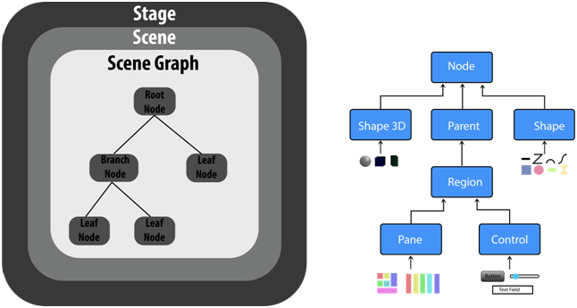

# JAVA

## POP vs OOP in Java: A Comparison

| Feature              | Procedural Oriented Programming (POP)    | Object Oriented Programming (OOP)                  |
|----------------------|------------------------------------------|----------------------------------------------------|
| **Focus**            | Functions and procedures                 | Objects and their interactions                     |
| **Structure**        | Top-down approach                        | Bottom-up approach                                 |
| **Data & Functions** | Separated, data can be accessed globally | Encapsulated within objects                        |
| **Data Access**      | Global access, less secure               | Restricted access through methods, more secure     |
| **Reusability**      | Low, code duplication is common          | High, inheritance and polymorphism promote reuse   |
| **Extensibility**    | Difficult to extend or modify code       | Easier to extend with inheritance and polymorphism |
| **Maintainability**  | Difficult to maintain large codebases    | Easier to maintain due to modularity               |
| **Examples**         | C, FORTRAN                               | Java, C++, Python                                  |


## Understanding the Java Ecosystem: JDK, JRE, JVM and JIT

### Java Development Kit (JDK)

*   **Definition:** The JDK is a comprehensive software development kit that provides everything you need to develop, debug, and run Java applications.
*   **Components:**
    *   **Java Runtime Environment (JRE):** Used to run Java applications.
    *   **Development Tools:**
        *   **javac:** Java compiler to convert Java source code into bytecode.
        *   **java:** Java interpreter to execute Java bytecode.
        *   **jar:** Utility for packaging Java classes into JAR (Java Archive) files.
        *   **javadoc:** Generates API documentation from Java source code.
        *   **Debugger:** Helps identify and fix errors in your code.
*   **Who needs it?:** Anyone who wants to develop Java applications.

### Java Runtime Environment (JRE)

*   **Definition:** The JRE is a software environment that provides the minimum requirements for running compiled Java applications.
*   **Components:**
    *   **Java Virtual Machine (JVM):** Interprets and executes Java bytecode.
    *   **Core Libraries:** Provides essential functionalities like input/output, networking, and collections.
*   **Who needs it?:** Anyone who wants to run Java applications on their system.

### Java Virtual Machine (JVM)

*   **Definition:** The JVM is an abstract computing machine that enables a computer to run Java programs. It is the core component of the JRE and is responsible for interpreting and executing Java bytecode.
*   **Key Features:**
    *   **Platform Independence:** Allows Java applications to run on any system with a compatible JVM, regardless of the underlying operating system. (Write Once, Run Anywhere)
    *   **Automatic Memory Management:** Handles memory allocation and reallocation, reducing the risk of memory leaks.
    *   **Security:** Provides a secure environment for running Java applications.
*   **Who needs it?:** Developers don't directly interact with the JVM. It's automatically used when running Java applications through the JRE.

### Just In Time Compiler (JIT)
* The JVM includes a Just-In-Time compiler that dynamically translates bytecode into native machine code at runtime. This optimization process tailors the execution to the specific platform, enhancing performance while preserving platform independence.


### Relationship between JDK, JRE, JVM and JIT
*   **JDK:** Contains the JRE and additional development tools.
*   **JRE:** Contains the JVM and core libraries needed to run Java applications.
*   **JIT:** Convert java code to native Machine code (Java Bytecode)
*   **JVM:** The core component of the JRE that executes Java bytecode.

### Summary

*   **Develop Java Applications:** Use the JDK.
*   **Run Java Applications:** Use the JRE.
*   **Execute Java Bytecode:** The JVM does this within the JRE.

### Difference 

| Component                          | Description                                                               | Includes                                           |
|------------------------------------|---------------------------------------------------------------------------|----------------------------------------------------|
| **JDK (Java Development Kit)**     | A complete development environment for building Java applications.        | JRE + Development tools (compiler, debugger, etc.) |
| **JRE (Java Runtime Environment)** | Provides the minimum requirements for running compiled Java applications. | JVM + Core libraries (e.g., java.lang, java.util)  |
| **JVM (Java Virtual Machine)**     | Interprets and executes Java bytecode, providing platform independence.   | -                                                  | 

---
## Functions

### Types of functions: -
* No Return type—No Argument++
* With Return type—No Argument
* No Return type—With Argument
* With a Return type—With Argument

### To Call Method: -
Function_Name();

### Rules For Return Type: -
1. The Line Of Code After the Return Statement will not execute.
2. Return statements will not be allowed in the loop.
3. Return Statement Will Return Only One Value.

### Method OverLoading: -
1. You can change parameters When you have the same return type.
2. If the number of parameters is the same, we need to change the datatype.
3. You cannot just change the datatype of the arguments keeping the return type and the number of arguments the same for two methods.
---

## Constructor:-
1. Constructor should be the same name as the class name
2. There is no return type.
3. You can call a method inside the constructor.
4. We can use access Modifiers.
5. The constructor cannot be defined inside the constructor.

### Copy constructor
Here when we assign a constructor value, a constructor then it copies a constructor value to another.
#### Example: -
``` 
Constructor c = new Constructor();
Constructor c2 = new Constructor();
c2 = c;
``` 
---

### Difference between Method and construction
| Method                                                                                                    | Constructor                                                                             |
|-----------------------------------------------------------------------------------------------------------|-----------------------------------------------------------------------------------------|
| User can decide The method name.                                                                          | Construction name and class name should be the same.                                    |
| Method needs to be explicitly called.                                                                     | The construction is called implicitly during the object creation.                       |
| Method has a return type.                                                                                 | Construction has no return type.                                                        |
| We can call a method in the constructor.                                                                  | You cannot call the constructor inside the constructor.                                 |
| When the method has the same name, it is method overloading we need to change the return type/parameters. | In construction, overloading with only different parameters.                            |
| A method is used to expose behaviour of object                                                            | it is used to initialize state of object                                                |
| It is not provided by compiler in any case                                                                | java compiler provides a default constructor if you don't have any constructor in class |
| They are inherited by subclass                                                                            | they are not inherited by subclass                                                      |
| The constructor is never static or final                                                                  | A method can be static or final                                                         |

---

## Exception :-
In Java, an Exception is an unwanted or unexpected event, which occurs during the execution of a program, i.e., at run time, that disrupts the normal flow of the program’s instructions. Exceptions can be caught and handled by the program. When an exception occurs within a method, it creates an object. This object is called the exception object. It contains information about the exception, such as the name and description of the exception and the state of the program when the exception occurred.

### Major reasons why an exception Occurs
* Invalid user input
* Device failure
* Loss of network connection
* Physical limitations (out-of-disk memory)
* Code errors
* Opening an unavailable file

### Exception Handling: -
It is used to handle exceptions using try-catch.

```
try{ 
    //code
}
Catch(ExceptionObjecct eo){ 
    //code
}
Final{ 
    //code
}
```
#### Example:-

```
    int a=10 , b = 5 , c = 5;
    try{
       int x = a/(b-c);
    }
    catch(arithmeticexception e){
       System.out.println("divide by zero .");
    }
       int y = a/(b+c)
       System.out.println(y)
```
So In Java Errors that cannot be handled by the user or programmer

Ex:—       
Virtual matching error, Stack Overflow, Out of Memory error, etc.

### Types of exceptions: -
1. IO Exception
2. SQLException
3. ClassNotFoundException
4. RuntimeException:—      
     1. ArithmeticException   
     2. NullPointerException   
     3. NumberFormetException       
     4. StringIndexException
     5. IndexOutOfBoundException  
        1) ArrayIndexOutOfBounds
        2) StringIndexOutOfBounds

### WRITE A PROGRAM USING MULTIPLE CATCH BLOCKS.

        try{

        }
        Catch(ExceptionObjecct eo){

        }Catch(ExceptionObjecct eo){

        }Catch(ExceptionObjecct eo){

        }
        Final{

        }

### Unchecked Exception: -
Exception predicted by the programmer, and it will handle at compile time.

### Checked Exception: -
Exception it will check at run time error.
It is comparable to handle check exceptions in the compiler.
Compiler tails it may be possible to come error at run time that the file has not found an exception,
so it is comparable to handle check exception.
We can handle check exceptions in two ways
1. Using Try Catch Block
2. Using throws keyword.

#### Example:-
// Using Try-Catch Block
``` 
try {
    Printwriter pw = new Printwriter("abc.txt");
}catch(FilenotfoundException e){
    System.out.println("File Not Found.."+e.getMessage());
}
```

### Usage of Throws Keyword: -
* Throws keyword is used for checked exceptions.
* We can declare exceptions with the method signature using the throw keyword.
* We can declare multiple exceptions using the throw keyword.
* We can handle multiple exceptions at a time.
* throws Keyword Delegate the responsibility of exception handling to caller method.

### Syntax:-

    return_type method_Name() throws exception_class_Name{}

### Example:-

    public static void main(String[] args) throws FileNotFoundException , ClassNotFoundException{
        Printwriter pw = new Printwriter("abc.txt");
    }


## Throw and Throws in Java:
> Both `throw` and `throws` keywords in Java are crucial for exception handling, but they serve distinct purposes.
Let's break down their functionalities:

### Throw Keyword

*   **Purpose:** Used to explicitly throw an exception within a method or block of code.
*   **Syntax:**
    ```
    throw new ExceptionType("Optional message describing the exception");
    
    ```
*   **Explanation:**

    *   You can use `throw` with any throwable object (e.g., Exception, RuntimeException, or custom exception classes).
    *   When an exception is thrown, the normal flow of execution stops, and the control is transferred to the nearest matching `catch` block in the call stack.
    *   If no matching `catch` block is found, the program terminates abnormally.
*   **Example:**

```
public void checkAge(int age) {
if (age < 18) {
throw new ArithmeticException("Access denied - You must be at least 18 years old.");
}
// ... rest of the code ...
}

```

In this example, if the `age` is less than 18,
the `checkAge` method throws an `ArithmeticException` with a descriptive message.

### Throws Keyword

*   **Purpose:** Used in a method signature to declare the types of exceptions that the method might throw.
*   **Syntax:**
```
returnType methodName(parameters) throws ExceptionType1, ExceptionType2 {
// ... method body ...
}

```

*   **Explanation:**
    *   `throws` acts as a contract, informing the caller of the method about potential exceptions they need to handle.
    *   If a checked exception (exceptions that are not subclasses of `RuntimeException`) is thrown within the method, it must be declared using `throws`.
    *   Unchecked exceptions (subclasses of `RuntimeException`) do not need to be declared, but it can be helpful for documentation purposes. 
* **Example:**
```
public void readFile(String fileName) throws IOException {
    // Code to open and read the file...
    // ... which might throw an IOException
}
```
Here, `readFile` declares that it might throw an `IOException`.
Any code calling `readFile` must either handle the exception using a `try-catch` block
or further declare it using `throws` in its own signature.

### Key Differences between Throw and Throws
| Feature                  | Throw                                                                                                                                                                          | Throws                                                                                                                      |
|--------------------------|--------------------------------------------------------------------------------------------------------------------------------------------------------------------------------|-----------------------------------------------------------------------------------------------------------------------------|
| **Purpose**              | To explicitly raise an exception at a specific point in the code.                                                                                                              | To signal that a method might throw an exception.                                                                           |
| **Placement**            | Inside a method body.                                                                                                                                                          | In the method signature.                                                                                                    |
| **Syntax**               | `throw new ExceptionType("Error message");`                                                                                                                                    | `returnType methodName(parameters) throws ExceptionType1, ExceptionType2, ...`                                              |
| **Exception Handling**   | Requires a try-catch block to handle the exception within the same method or a throws declaration to propagate it to the calling method.                                       | Informs the calling method that it needs to handle the potential exception using a try-catch block or further propagate it. |
| **Number of Exceptions** | Throws a single exception at a time.                                                                                                                                           | Can list multiple potential exception types.                                                                                |
| **Example**              | void readFile(String filename){<br/>if (filename == null) {<br/>throw new IllegalArgumentException("Filename cannot be null");<br/>}  <br/>  // Code to read the file...<br/>} | void processFile(String filename) throws IOException {<br/> // May throw IOException <br/>}                                 |

### Choosing Between Throw and Throws

*   Use `throw` when you want to explicitly stop the normal execution flow and handle an exceptional situation.
*   Use `throws` to indicate potential exceptions that a method might throw but doesn't handle itself, delegating the responsibility to the calling code.

> In conclusion, both `throw` and `throws` are essential for writing robust and maintainable Java code by effectively handling exceptions and providing clear information about potential error conditions.


## User-Defined Exceptions in Java
> In Java, you can create your own exception types by extending the `Exception` class or one of its subclasses.
This allows you to define specific exceptions for your application, making error handling more precise and informative.

### Defining a Custom Exception Class

Here's the basic structure for defining a user-defined exception:

```
public class MyCustomException extends Exception {

    // Constructor that calls the superclass constructor
    public MyCustomException(String message) {
        super(message);
    }

    // Optional: additional constructors or methods
}

```

#### Explanation:

*   **`MyCustomException`**: Replace this with the name of your exception class.
*   **`extends Exception`**: This indicates that your class inherits from the `Exception` class, making it a checked exception. If you want to create an unchecked exception, extend `RuntimeException` instead.
*   **Constructor**: You can define constructors to initialize the exception object with specific details, such as an error message.

### Example:

Let's create a custom exception called `InvalidAgeException` that will be thrown when an invalid age is entered
(e.g., a negative age):

```
public class InvalidAgeException extends Exception {

    public InvalidAgeException(String message) {
        super(message);
    }
}

```

### Using the Custom Exception

Now, let's use `InvalidAgeException` in a method that validates age:

```
public void checkAge(int age) throws InvalidAgeException {
if (age < 0) {
throw new InvalidAgeException("Age cannot be negative: " + age);
}
// ... rest of the code
}

```

**Explanation:**

1.  **`throws InvalidAgeException`**: This declaration indicates that the `checkAge` method might throw an `InvalidAgeException`.
2.  **`throw new InvalidAgeException(...)`**: If the age is invalid (negative), we create a new `InvalidAgeException` object with an appropriate error message and throw it.

### Handling the Exception

When calling the `checkAge` method, you need to handle the potential `InvalidAgeException` using a `try-catch` block:

```
try {
checkAge(-5);
} catch (InvalidAgeException e) {
System.err.println("Error: " + e.getMessage());
}

```

This code will catch the `InvalidAgeException` and print the error message to the console.

### Advantages of User-Defined Exceptions

*   **Clarity**: They provide specific information about the type of error that occurred, making the code more readable and easier to debug.
*   **Flexibility**: You can tailor exceptions to your application's needs, including adding custom fields or methods to hold relevant data.
*   **Maintainability**: By defining specific exception types, you can centralize error handling logic and improve code organization.


---
## Access modifiers


| Access Modifier                 | Class | Package | Subclass | World | Description                                                                                                                     |
|---------------------------------|-------|---------|----------|-------|---------------------------------------------------------------------------------------------------------------------------------|
| `public`                        | Yes   | Yes     | Yes      | Yes   | Accessible from anywhere. There are no restrictions on access.                                                                  |
| `protected`                     | Yes   | Yes     | Yes      | No    | Accessible within the same class, package, and subclasses (even if the subclass is in a different package).                     |
| `no modifier` (package-private) | Yes   | Yes     | No       | No    | Accessible within the same class and package, but not from subclasses or outside the package.                                   |
| `private`                       | Yes   | No      | No       | No    | Accessible only within the same class. Not accessible from anywhere else, including subclasses or even within the same package. |

---
## Wrapper Class
* Java support-only calls by value, so we use a wrapper class.    
* Used to create a Reference of a variable.   
* It is used to provide a mechanism to convert primitive into object and object into primitive.   
* It has two types
  1. Autoboxing
  2. Unboxing

| Feature             | Autoboxing                                                                                          | Unboxing                                                                                          |
|---------------------|-----------------------------------------------------------------------------------------------------|---------------------------------------------------------------------------------------------------|
| **Definition**      | Automatic conversion of primitive types to their corresponding wrapper objects.                     | Automatic conversion of wrapper objects to their corresponding primitive types.                   |
| **Process**         | The compiler implicitly creates a wrapper object for the primitive type.                            | The compiler implicitly extracts the primitive value from the wrapper object.                     |
| **Example**         | `int i = 10; Integer obj = i;`                                                                      | `Integer obj = 10; int i = obj;`                                                                  |
| **Purpose**         | Simplifies code by eliminating the need to explicitly create wrapper objects.                       | Allows direct use of primitive values from wrapper objects without explicit conversion.           |
| **Performance**     | May introduce slight overhead due to object creation.                                               | Generally more efficient than explicit casting.                                                   |
| **Usage Scenarios** | - Collections (which require objects) - Generics - Method parameters/return types requiring objects | - Arithmetic operations - Assignments to primitive variables - Comparisons using primitive values |

> **Note:** While autoboxing and unboxing provide convenience, it's essential to be mindful of potential performance implications and null values when working with wrapper objects.

### uses
1. Change the value in the method
2. Serialization
3. Synchronization

### Example:-
``` 
int a = 20;
Integer i = Integer.valueOf(a);
Integer j = a; // autoboxing
Integer a = new Integer(3);
int i = a.intValue(); //Explicit
```
### method in a string wrapper class


| No. | Method                                                                                | Description                                                          |
|-----|---------------------------------------------------------------------------------------|----------------------------------------------------------------------|
| 1   | char charAt(int index)                                                                | It returns char value for the particular index.                      |
| 2   | int length()                                                                          | It returns string length                                             |
| 3   | static String format(String format, Object... args)                                   | It returns a formatted string                                        |
| 4   | static String format(Locale I, String format, Object... args)                         | It returns formatted string with given locale.                       |
| 5   | String substring(int beginIndex)                                                      | It returns substring for given begin index.                          |
| 6   | String substring(int beginIndex, int endIndex)                                        | It returns substring for given begin index and end index.            |
| 7   | boolean contains(CharSequence s)                                                      | It returns true or false after matching the sequence of char value.  |
| 8   | static String join(CharSequence delimiter, CharSequence... elements)                  | It returns a joined string                                           |
| 9   | static String join(CharSequence delimiter, Iterable<? extends CharSequence> elements) | It return joined String                                              | 
| 10  | boolean equals(Object another)                                                        | It checks the equality of string with the given object.              |
| 11  | boolean isEmpty()                                                                     | It checks if string is empty.                                        |
| 12  | String concat(String str)                                                             | It concatenates the specified string.                                | 
| 13  | String replace(char old, char new)                                                    | It replaces all occurrences of the specified char value.             | 
| 14  | String replace(CharSequence old, CharSequence new)                                    | It replaces all occurrences of the specified CharSequence.           | 
| 15  | static String equalsIgnoreCase(String another)                                        | It compares another string. It doesn't check case.                   |
| 16  | String[] split(String regex)                                                          | It returns a split string matching regex.                            |
| 17  | String[] split(String regex, int limit)                                               | It returns a split string matching regex and limit.                  |
| 18  | int indexOf(int ch)                                                                   | It returns the specified char value index.                           |
| 19  | int indexOf(int ch, int fromIndex)                                                    | It returns the specified char value index starting with given index. | 
| 20  | int indexOf(String substring)                                                         | It returns the specified substring index.                            | 
| 21  | int indexOf(String substring, int fromIndex)                                          | It returns the specified substring index starting with given index.  |
| 22  | String toLowerCase()                                                                  | It returns a string in lowercase.                                    | 
| 23  | String toLowerCase(Locale I)                                                          | It returns a string in lowercase using specified locale.             |
| 24  | String toUpperCase()                                                                  | It returns a string in uppercase.                                    | 
| 25  | String toUpperCase(Locale I)                                                          | It returns a string in uppercase using specified locale.             |
| 26  | String trim()                                                                         | It removes beginning and ending spaces of this string.               |
| 27  | static String valueOf(int value)                                                      | It converts given type into string. It is an overloaded method.      | 


> The object or variable of a string class will never be changed even if you contact replace trim or any operation to it To save the updated screen after these operations You need to create another variable or object of the string class.

### Example of string class methods
``` 
// length()
"Nimesh".length();  // returns 6

// charAt()
"Nimesh".charAt(3); // returns  ‘m’

// contains
"nim".concat("esh"); // returns “nimesh”

// replace
String s1 = “Nimesh“;
String s2 = “Nimesh”.replace(‘N’ ,’g’); // returns “gimesh”

// equals
“Nimesh”.equals(“Nimesh”); // returns true
“Nimesh”.equals(“nimesh”); // returns false

// equalsIgnoreCase
“Nimesh”.equalsIgnoreCase(“Nimesh”); // returns true
“Nimesh”.equalsIgnoreCase(“nimesh”); // returns true

// ___.toLowerCase();
"NiMeSh".toLowerCase(); // return "nimesh"

// ___.toUpperCase();
"nImEsH".toUpperCase(); // return "NIMESH"

--- For advance ---

// substring()
"Nimesh".substring(3); // returns “mesh”
"nimesh".substring(2, 5); // returns “mes” == [2,5)
// 2 is inclusive and 5 is exclusive

//index of
String s = ”Learn Share Learn”;
int output = s.indexOf(“Share”); // returns 6
// return -1 if it can't find it 
// if we put location > length then it generate IndexOutOfBounds exception 
```

---

### Difference between `String` vs `StringBuffer`
| String                                                                                                                                                                        | String Buffer                                                                                                  |
|-------------------------------------------------------------------------------------------------------------------------------------------------------------------------------|----------------------------------------------------------------------------------------------------------------|
| The string class objects are immutable.                                                                                                                                       | The string Buffer class objects are mutable.                                                                   |
| String Class objects holds its string length you can not change its size.                                                                                                     | In StringBuffer Class objects you can change its size.                                                         |
| You can concat the string string with other string and replace the characters of the string at a given position but you can not insert a character sequence amidst the string | You can insert a character sequence in a string buffer object retaining the original characters in the string. |
| You can not delete any character from a string class object.                                                                                                                  | You can delete any character from a string Buffer class object which also adjust the …                         |
| String class object need to be type case explicitly to use string Buffer class methods                                                                                        | String Buffer class object can use string class methods directly                                               |
| You don't need a any object to initialize a variable.                                                                                                                         | You comparably need a object to initialize a variable.                                                         |

> You can convert a string class object into a string buffer object to access the methods of string buffer class. You cannot directly pass a string to a string buffer object.

### String Buffer Methods

| Methods          | Action Performed                                                            |
|------------------|-----------------------------------------------------------------------------|
| append()         | Used to add text at the end of the existing text.                           |
| length()         | The length of a StringBuffer can be found by the length() method            |
| capacity()       | the total allocated capacity can be found by the capacity() method          |
| charAt()         | This method returns the char value in this sequence at the specified index. |
| delete()         | Deletes a sequence of characters from the invoking object                   |
| deleteCharAt()   | Deletes the character at the index specified by the loc                     |
| ensureCapacity() | Ensures capacity is at least equal to the given minimum.                    |
| insert()         | Inserts text at the specified index position                                |
| length()         | Returns the length of the string                                            |
| reverse()        | Reverse the characters within a StringBuffer object                         |
| replace()        | Replace one set of characters with another set inside a StringBuffer object | 

#### Example:
``` 
StringBuffer sb = new StringBuffer("Hello");

sb.append(" World !"); // now sb = "Hello World"

sb.reverse(); // now sb = "dlroW olleH"

sb.length(); // return = 11

sb.insert(1,"java"); // return = "djavalroW olleH" //insert before the index (Won't delete)

sb.replace(1,5,""); // return = "dlroW olleH" // insert at the index (delete it)

sb.delete(0,5);// return = " olleH"

//When we create a string buffer object it allocates some capacity = 16
sb.capacity(); // return = 21 + length == 

```

---

### Difference between Character and String

| Character (char)              | String (java.lang.String)     |
|-------------------------------|-------------------------------|
| Primitive                     | Class                         |
| 2 bytes                       | Variable (depends on content) |
| `char c = 'a';`               | `String s = "hello";`         |
| Single character              | Sequence of characters        |
| `==` operator for compression | `.equals()` method            |
| Direct access                 | Methods like `charAt()`       |
| White space is ignored        | White space it not ignored    |
| Has `Character` wrapper class | it self is a wrapper class    |

---

## Abstraction in Java: A Guide in Markdown Format

Abstraction is a core principle in object-oriented programming, and Java provides robust mechanisms to implement it.
Let's explore the concept of abstraction and its implementation in Java.

### What is Abstraction?

Abstraction refers to the process
of hiding the internal details of how things work and exposing only the essential information to the user.
It focuses on what an object does instead of how it does it.

Think of a TV remote; you know the buttons to change channels or volume,
but you don't necessarily understand the complex electronics inside that make it work.
This is an abstraction in action.

### Benefits of Abstraction in Java:

* **Simplicity**: Makes code easier to understand and use by hiding complexity.
* **Flexibility**: Allows for easy modification of internal implementation without affecting user interaction.
* **Maintainability**: Simplifies code maintenance and reduces the impact of changes.
* **Reusability**: Promotes code reuse by creating generic components applicable in different scenarios.

### Implementing Abstraction in Java:

Java provides two primary ways to achieve abstraction:

* **Abstract classes**: Classes defined with the `abstract` keyword, containing both abstract methods (without implementation) and concrete methods (with implementation).
* **Interfaces**: Completely abstract types that define method signatures without any implementation. They specify the behavior a class must implement.

#### Abstract Classes:

1. **Defining an abstract class:**

    ```
    public abstract class Shape {
    public abstract double area();
    public abstract double perimeter();
    
           public void printInfo() {
               System.out.println("This is a shape.");
           }
    }
    ```
2. **Creating concrete classes:**

    ```
    public class Circle extends Shape {
    private double radius;
           // Constructor and other methods...
           @Override
           public double area() {
               return Math.PI * radius * radius;
           }
           @Override
           public double perimeter() {
               return 2 * Math.PI * radius;
       }
    }
    ```

#### Interfaces:

1. **Defining an interface:**
    ```
    public interface Drawable {
        void draw();
    }
    ```
2. **Implementing the interface:**

    ```
    public class Circle implements Drawable {
    // ...
    
           @Override
           public void draw() {
               // Code to draw a circle
           }
    }
    ```

### Key Differences: Abstract Class vs. Interface:

| Feature          | Abstract Class                              | Interface                                                 |
|------------------|---------------------------------------------|-----------------------------------------------------------|
| Implementation   | Can have both abstract and concrete methods | Only abstract methods (with default methods since Java 8) |
| Inheritance      | Extends (single inheritance)                | Implements (multiple inheritance)                         |
| Member Variables | Can have member variables                   | Can only have constants                                   |
| Relationship     | "is-a" relationship                         | "can-do" relationship                                     |

### Choosing Between Abstract Class and Interface:

* **Use an abstract class:** When you want to share some implementation details and there is a clear "is-a" relationship between the classes.
* **Use an interface:** When you want to define a contract for behavior without specifying any implementation and there is a "can-do" relationship between the classes.


---

## Super Keyword

The `super` keyword in Java acts as a reference to the parent class (superclass) of the current class. It allows you to access members (fields, methods, and constructors) of the parent class from within the child class (subclass). This is particularly useful when:

*   **Accessing hidden members:** If a child class declares a member with the same name as a member in the parent class, the child class's member "hides" the parent's member. You can use `super` to access the hidden member of the parent class.
*   **Calling parent class methods:** You can use `super` to explicitly call a method from the parent class, even if the child class has overridden that method.
*   **Invoking parent class constructors:** Within a child class constructor, you can use `super` to invoke a specific constructor of the parent class, ensuring proper initialization of inherited members.

### Syntax and Usage:

There are three main ways to use the `super` keyword in Java:

**1. Accessing Superclass Members:**

```
super.memberName
```

*   Replace `memberName` with the specific field or method you want to access from the parent class.

**2. Calling Superclass Methods:**

```
super.methodName(arguments);
```

*   Replace `methodName` with the name of the parent class method you want to call.
*   Include `arguments` if the method requires any parameters.

**3. Invoking Superclass Constructors:**

```
super(arguments);
```

*   This statement must be the first line within the child class constructor.
*   Replace `arguments` with the values required by the parent class constructor you want to invoke.

### Example:

```
class Animal {
String name;

    Animal(String name) {
        this.name = name;
    }
    
    void makeSound() {
        System.out.println("Generic animal sound");
    }
}

class Dog extends Animal {
String breed;

    Dog(String name, String breed) {
        super(name); // Calls Animal's constructor to set name
        this.breed = breed;
    }
    
    @Override
    void makeSound() {
        System.out.println("Woof!");
    }
    
    void printInfo() {
        System.out.println("Name: " + super.name); // Accesses name from Animal
        System.out.println("Breed: " + breed);
        super.makeSound(); // Calls Animal's makeSound() method
    }
}

```

In this example, the `Dog` class extends the `Animal` class. The `Dog` constructor uses `super(name)` to call the `Animal` constructor and initialize the `name` field. The `printInfo()` method in `Dog` uses `super.name` to access the inherited `name` field and `super.makeSound()` to call the `makeSound()` method from the `Animal` class.

**Remember:** The `super` keyword is a powerful tool for leveraging inheritance in Java, allowing you to build upon the functionality of existing classes and create more complex and flexible class hierarchies.


---

## Final Keyword

The `final` keyword in Java is a powerful tool that brings immutability and control to your code. It can be applied to different entities, each with specific implications:

**1. Final Variables:**

*   **Value cannot be changed once initialized:** This creates constants, ensuring their values remain fixed throughout the program execution.
*   **Initialization:** Must be done either during declaration or within the constructor (for non-static variables).
*   **Benefits:**
    *   **Improved code readability:** Clearly indicates values that won't change.
    *   **Enhanced security:** Prevents accidental modification of critical values.
    *   **Thread safety:** Final variables are inherently thread-safe.

**Example:**

```
final double PI = 3.14159; // Constant declaration and initialization

class Circle {
final double radius;

    Circle(double radius) {
        this.radius = radius; // Initialization in constructor
    }
}
```

**2. Final Methods:**

*   **Cannot be overridden by subclasses:** This preserves the intended behavior of the method across the inheritance hierarchy.
*   **Benefits:**
    *   **Guarantees specific functionality:** Ensures subclasses adhere to the designed behavior of the method.
    *   **Optimization potential:** The compiler may perform optimizations knowing the method won't be overridden.

**Example:**

```
class Shape {
public final double area() {
// Implementation to calculate area
}
}

class Square extends Shape {
// Cannot override area() method
}
```

**3. Final Classes:**

*   **Cannot be extended or subclassed:** Prevents inheritance, solidifying the class design.
*   **Benefits:**
    *   **Security and design control:** Restricts unintended extensions that might compromise the class's intended purpose.
*   **Considerations:** All methods within a final class are implicitly final.

**Example:**

```
final class MathUtils {
// Utility methods for mathematical operations
}

// Cannot create a subclass of MathUtils
```

**Key Points:**

*   **Immutability:** Final variables and references to objects cannot be changed, but the objects themselves may be mutable.
*   **Static final:** Combines `static` and `final` to create constants associated with the class itself, accessible directly using the class name.
*   **Blank final:** Variables declared as `final` but not initialized during declaration. They must be initialized within the constructor.

**In conclusion, the `final` keyword promotes code clarity, safety, and efficiency. Use it strategically to define constants, prevent unintended modifications, and ensure design integrity in your Java programs.**

---


## ArrayList

**What is it?**

An ArrayList is a resizable array implementation in Java. It's part of the Java Collections Framework and is found in the `java.util` package.

**Key Points:**

* **Dynamic sizing:** Unlike traditional arrays, ArrayLists automatically grow in size as you add elements.
* **Object storage:** ArrayLists store objects, so you need to use wrapper classes (like `Integer` for `int`) when storing primitive types.
* **Index-based access:** Elements are accessed using their index, similar to arrays.
* **Methods:** ArrayLists provide various methods for adding, removing, searching, and sorting elements.
* **Synchronization:** ArrayList class is non Synchronized

**Basic Usage:**

```
// Import this
// import java.util.ArrayList;

// Create an ArrayList of Strings
ArrayList<String> names = new ArrayList<>();

// Add elements
names.add("Nimesh");
names.add("Nims");

// Access element at index 0
String firstName = names.get(0); // "Nimesh"

// Get the size of the ArrayList
int size = names.size(); // 2

// Remove the element at index 1
names.remove(1);

// Check if the ArrayList is empty
boolean isEmpty = names.isEmpty(); // false


```
**Advantages:**

* **Flexibility:** Easily add or remove elements.
* **Dynamic:** No need to predefine the size.
* **Convenience:** Offers many built-in methods for managing elements.

**Disadvantages:**

* **Performance:** Can be slower than traditional arrays for certain operations (e.g., accessing elements by index).
* **Type safety:** Requires using wrapper classes for primitive types.

**When to use ArrayLists?**

* When you need a collection that can dynamically resize.
* When you need to frequently add or remove elements.
* When you need to store objects of different types (using generics).

**Alternatives:**

* **Traditional arrays:** If you know the size of the collection beforehand and need optimal performance.
* **LinkedList:** If you frequently add or remove elements from the beginning or middle of the collection.

**ArrayList Methods in Java**

| **Method**                | **Description**                                                                                                                 |
|---------------------------|---------------------------------------------------------------------------------------------------------------------------------|
| add(E element)            | Appends the specified element to the end of the list.                                                                           |
| add(int index, E element) | Inserts the specified element at the specified position in the list.                                                            |
| remove(int index)         | Removes the element at the specified position in the list.                                                                      |
| remove(Object o)          | Removes the first occurrence of the specified element from the list, if it is present.                                          | 
| set(int index, E element) | Replaces the element at the specified position in the list with the specified element.                                          |
| get(int index)            | Returns the element at the specified position in the list.                                                                      |
| size()                    | Returns the number of elements in the list.                                                                                     |
| isEmpty()                 | Returns true if the list contains no elements.                                                                                  |
| contains(Object o)        | Returns true if the list contains the specified element.                                                                        | 
| clear()                   | Removes all of the elements from the list.                                                                                      |
| indexOf(Object o)         | Returns the index of the first occurrence of the specified element in the list, or -1 if the list does not contain the element. |
| lastIndexOf(Object o)     | Returns the index of the last occurrence of the specified element in the list, or -1 if the list does not contain the element.  | 


## ArrayList vs. Array vs. LinkedList in Java

| Feature                | ArrayList                                              | Array                                      | LinkedList                                               |
|------------------------|--------------------------------------------------------|--------------------------------------------|----------------------------------------------------------|
| **Data Structure**     | Dynamic array                                          | Fixed-size array                           | Doubly linked list                                       | 
| **Resizing**           | Automatic                                              | Manual                                     | Automatic                                                |
| **Element Access**     | O(1)                                                   | O(1)                                       | O(n)                                                     |
| **Insertion/Deletion** | O(n) at the beginning or middle, O(1) at the end       | N/A                                        | O(1) at the beginning or end, O(n) in the middle         |
| **Memory Usage**       | Less efficient due to potential resizing               | Most efficient                             | Less efficient due to extra memory needed for links      |
| **Use Cases**          | Frequent access by index, adding/removing from the end | Fixed number of elements, efficient access | Frequent insertions/deletions at the beginning or middle |


Add collection and iteration class in it with for each loop

---

## Interface

> The interface in Java is a mechanism to achieve abstraction. There can be only abstract methods in the Java interface, not the method body. It is used to achieve abstraction and multiple inheritances in Java using Interface.

### Uses of Interfaces in Java are mentioned below:

* It is used to achieve total abstraction.
* Since Java does not support multiple inheritances in the case of class, by using an interface, it can achieve multiple inheritances.
* Any class can extend only one class, but can any class implement an infinite number of interfaces.
* It is also used to achieve loose coupling.
* Interfaces are used to implement abstraction.

### Syntax
``` 
interface {
// declare constant fields
// declare methods that abstract
// by default.   
}
```

### Difference Between Class and Interface

| Class                                                                       | Interface                                                              |
|-----------------------------------------------------------------------------|------------------------------------------------------------------------|
| In class, you can instantiate variables and create an object.               | In an interface, you can’t instantiate variables and create an object. |
| A class can contain concrete (with implementation) methods                  | The interface cannot contain concrete (with implementation) methods.   |
| The access specifiers used with classes are private, protected, and public. | In Interface, only one specifier is used — Public.                     |

### Relationship Between Class and Interface


### Advantage
* Without bothering about the implementation part, we can achieve the security of the implementation.
* In Java, multiple inheritances are not allowed; however, you can use an interface to make use of it as you can implement more than one interface.

### Multiple Inheritance in Java Using Interface


### take out
* We can’t create an instance (interface can’t be instantiated) of the interface, but we can make the reference to it that refers to the Object of its implementing class.
* A class can implement more than one interface.
* An interface can extend to another interface or interface (more than one interface).
* A class that implements the interface must implement all the methods in the interface.
* All the methods are public and abstract. All the fields are public, static, and final.
* It is used to achieve multiple inheritances.
* It is used to achieve loose coupling.
* Inside the Interface is not possible to declare instance variables because by default variables are public static final.
* Inside the Interface, constructors are not allowed.
* Inside the interface, the main method is not allowed.
* Inside the interface, static, final, and private methods declaration is not possible.

### Example:

``` 
interface In1
{
    void display();
}
class TestClass implements In1
{
    public void display(){
        System.out.println("hello");
    }
    public static void main (String[] args)
    {
        TestClass t = new TestClass();
        t.display();
    }
}
```
---

## Difference between Upcasting and Downcasting

| Feature                | Upcasting                                                                                                    | Downcasting                                                                                           |
|------------------------|--------------------------------------------------------------------------------------------------------------|-------------------------------------------------------------------------------------------------------|
| **Concept**            | Treating a more specific type as a more general type.                                                        | Treating a more general type as a more specific type.                                                 |
| **Direction**          | Moving **up** the inheritance hierarchy.                                                                     | Moving **down** the inheritance hierarchy.                                                            |
| **Implicit/Explicit**  | Implicit (automatic) - No explicit casting needed.                                                           | Explicit - Requires a cast operator `(TargetType)`.                                                   |
| **Safety**             | Safer as it's guaranteed to succeed.                                                                         | Risky - Can throw a `ClassCastException` if the object isn't of the target type.                      |
| **Example**            | `Animal animal = new Dog();`  (Dog is a type of Animal)                                                      | `Dog dog = (Dog) animal;` (Assuming `animal` references a Dog object)                                 |
| **Use Cases**          | Polymorphism, treating objects of different types uniformly.                                                 | Accessing specific methods/properties of a subclass.                                                  | 
| **Things to remember** | - The object's actual type remains unchanged.  - Access is limited to members defined in the reference type. | - Always check the object's type before downcasting using `instanceof` to avoid `ClassCastException`. |

---

## `instanceof` operator in Java
* This operator returns either true or false and hence is majorly used in conditional statements.
* it is used to check whether a given object belongs to a particular class or not.
* an object of subclass is also an instanceof parent class.
``` 
class Parent {
}
class Child extends Parent {
} 
class Test {
    public static void main(String[] args)
    {
        Parent pobj = new Parent();
        if (pobj instanceof Child)
            System.out.println("pobj is instance of Child");
        else
            System.out.println("pobj is NOT instance of Child");
    }
}
```

---

## Inheritance 

### Introduction

Inheritance is a fundamental concept in object-oriented programming (OOP) that allows you to create new classes (subclasses) based on existing ones (superclasses). This promotes code reusability and a hierarchical structure, where subclasses inherit the properties and methods of their superclasses, while also adding their own unique features.

### Key Terminology

* **Superclass/Parent Class:** The class from which another class inherits.
* **Subclass/Child Class:** The class that inherits from a superclass.
* **Extends Keyword:** Used to indicate that a subclass inherits from a superclass.
* **IS-A Relationship:** A subclass IS-A type of its superclass.

### Syntax

```
class Subclass extends Superclass {
// Subclass members
}
```

### Example

```
// Superclass (Parent Class)
class Animal {
String name;

    void eat() {
        System.out.println(name + " is eating.");
    }
}

// Subclass (Child Class)
class Dog extends Animal {
void bark() {
System.out.println(name + " is barking.");
}
}

public class Main {
public static void main(String[] args) {
Dog myDog = new Dog();
myDog.name = "Buddy";
myDog.eat();  // Inherited from Animal class
myDog.bark(); // Specific to Dog class
}
}
```

**Output:**

```
Buddy is eating.
Buddy is barking.
```

### Types of Inheritance

* **Single Inheritance:** A subclass inherits from only one superclass. (e.g., Dog inherits from Animal)
* **Multilevel Inheritance:** A subclass inherits from a superclass, which in turn inherits from another superclass, creating a hierarchy. (e.g., BabyDog inherits from Dog, which inherits from Animal)
* **Hierarchical Inheritance:** Multiple subclasses inherit from a single superclass. (e.g., Dog and Cat both inherit from Animal)
* > **Note:** Java does not support multiple inheritance (a subclass inheriting directly from multiple superclasses) to avoid ambiguity and complexity.


### Advantages of Inheritance

* **Code Reusability:** Avoids code duplication by inheriting members from the superclass.
* **Extensibility:** Easily extend existing functionality by creating subclasses with additional features.
* **Maintainability:** Changes made to the superclass automatically reflect in subclasses, making code easier to maintain.

### Important Points

* **Constructors:** Subclasses do not inherit constructors from superclasses. You need to explicitly call the superclass constructor using `super()` within the subclass constructor.
* **Method Overriding:** Subclasses can override inherited methods to provide their own implementation.
* **Access Modifiers:** Inheritance rules apply to access modifiers (`private`, `protected`, `public`).

---

## File Handling 

File handling in Java allows you to interact with files stored on your system. This includes operations like creating, reading, writing, and modifying files. Java provides various classes and methods within the `java.io` package to achieve this.

### Essential Classes for File Handling:

1. **File Class:** Represents a file or directory path. It provides methods to check existence, create, delete, and get information about files/directories.

2. **InputStream and OutputStream:** Abstract classes representing an input stream of bytes and an output stream of bytes respectively. They serve as base classes for more specific stream classes.

3. **FileInputStream and FileOutputStream:** Used for reading from and writing to files as a stream of bytes.

4. **Reader and Writer:** Abstract classes representing a reader and a writer of characters respectively. Similar to InputStream and OutputStream, they are base classes for more specific reader/writer classes.

5. **FileReader and FileWriter:** Used for reading from and writing to files as a stream of characters.

6. **BufferedReader and BufferedWriter:** Enhance the performance of reading and writing characters by buffering data.

### Reading from a File:

**Example using FileReader and BufferedReader:**

```
import java.io.*;

public class ReadFile {
public static void main(String[] args) throws IOException {
FileReader fileReader = new FileReader("example.txt");
BufferedReader bufferedReader = new BufferedReader(fileReader);

    String line;
    while ((line = bufferedReader.readLine()) != null) {
      System.out.println(line);
    }

    bufferedReader.close();
}
}
```

**Explanation:**

1. A `FileReader` object is created to read the file "example.txt."
2. A `BufferedReader` object is created using the `FileReader` to improve efficiency.
3. The `readLine()` method reads each line from the file until it reaches the end (null).
4. Each line is printed to the console.
5. The `close()` method is called to release resources.

### Writing to a File:

**Example using FileWriter and BufferedWriter:**

```
import java.io.*;

public class WriteFile {
public static void main(String[] args) throws IOException {
FileWriter fileWriter = new FileWriter("output.txt");
BufferedWriter bufferedWriter = new BufferedWriter(fileWriter);

    bufferedWriter.write("This is an example of writing to a file.");
    bufferedWriter.newLine(); // Add a new line
    bufferedWriter.write("Another line of text.");

    bufferedWriter.close();
}
}
```

**Explanation:**

1. A `FileWriter` object is created to write to the file "output.txt."
2. A `BufferedWriter` object is created using the `FileWriter` for efficiency.
3. The `write()` method writes the specified text to the file.
4. The `newLine()` method adds a new line.
5. The `close()` method is called to ensure data is written and resources are released.

### Additional Notes:

* Always remember to handle potential `IOExceptions` when working with files.
* Use appropriate reader/writer classes based on whether you need to handle bytes or characters.
* Utilize `BufferedReader` and `BufferedWriter` for efficient reading and writing operations.
* Explore other classes in `java.io` package for advanced file handling needs.

This overview provides a basic understanding of file handling in Java. You can explore the official Java documentation and various online resources for more advanced concepts and examples.

---

## Buffered Reader and Buffered Writer 

Buffered Reader and Buffered Writer are classes in Java that enhance the efficiency of reading and writing data to and from streams. They achieve this by using an internal buffer, which reduces the number of interactions with the underlying stream, leading to faster I/O operations.

**Buffered Reader**

*   **Functionality:** Reads text from a character-input stream, buffering characters for efficient reading.
*   **Benefits:**
    *   Reduces the number of calls to the underlying stream, improving performance.
    *   Provides methods for reading lines of text, which is convenient for processing textual data.
*   **Example:**

```
try (BufferedReader reader = new BufferedReader(new FileReader("input.txt"))) {
String line;
while ((line = reader.readLine()) != null) {
// Process each line of text
System.out.println(line);
}
} catch (IOException e) {
e.printStackTrace();
}

```

**Explanation:**

1.  **Create BufferedReader:** A BufferedReader is created, wrapping a FileReader (which reads characters from a file).
2.  **Read Lines:** The `readLine()` method reads a line of text from the buffered stream, and the loop continues until all lines are read.
3.  **Process Data:** Inside the loop, you can process the retrieved line of text as needed (e.g., printing it to the console in this example).
4.  **Exception Handling:** The code is enclosed in a try-with-resources block to ensure the reader is properly closed, even if exceptions occur.

**Buffered Writer**

*   **Functionality:** Writes text to a character-output stream, buffering characters for efficient writing.
*   **Benefits:**
    *   Reduces the number of calls to the underlying stream, improving performance.
    *   Provides methods for writing lines of text and flushing the buffer.
*   **Example:**

```
try (BufferedWriter writer = new BufferedWriter(new FileWriter("output.txt"))) {
String data = "This is some text to write.";
writer.write(data);  // Write string to buffer
writer.newLine();    // Write a new line character
writer.write("Another line of text.");
writer.flush();       // Flush the buffer to ensure data is written to the file
} catch (IOException e) {
e.printStackTrace();
}
```

**Explanation:**

1.  **Create BufferedWriter:** A BufferedWriter is created, wrapping a FileWriter (which writes characters to a file).
2.  **Write Data:** The `write()` method writes the string data to the buffer. `newLine()` adds a line break.
3.  **Flush Buffer:** `flush()` ensures that all data in the buffer is written to the underlying file.
4.  **Exception Handling:** The code is enclosed in a try-with-resources block to ensure the writer is properly closed, even if exceptions occur.

**Key Points:**

*   Buffered Reader and Buffered Writer are typically used with text-based data.
*   They provide significant performance improvements compared to unbuffered I/O when dealing with large amounts of data or frequent read/write operations.
*   Always remember to close the streams using a try-with-resources block or by explicitly calling the `close()` method to avoid resource leaks.

---

## Java FileInputStream Methods

| S. No. | Method          | Description                                                                       |
|--------|-----------------|-----------------------------------------------------------------------------------|
| 1      | read()          | Reads one byte of data from the input stream.                                     |
| 2      | read(byte[])    | Reads bytes from the stream and stores them in the specified array.               |
| 3      | mark()          | Marks the current position in the input stream for a later reset using `reset()`. |
| 4      | available()     | Returns the number of bytes available for reading without blocking.               |
| 5      | markSupported() | Checks if the stream supports the `mark()` and `reset()` methods.                 | 
| 6      | reset()         | Returns the control to the previously marked position in the stream.              |
| 7      | skip()          | Skips and removes a specified number of bytes from the input stream.              |
| 8      | close()         | Closes the input stream and releases associated resources.                        | 

---

## OutputStream Methods

| No. | Method                | Description                                                                      |
|-----|-----------------------|----------------------------------------------------------------------------------|
| 1.  | `write()`             | Writes the specified byte to the output stream.                                  |
| 2.  | `write(byte[] array)` | Writes the bytes within a specific array to the output stream.                   |
| 3.  | `close()`             | Closes the output stream.                                                        |
| 4.  | `flush()`             | Forces any data remaining in the output stream to be written to the destination. | 

---

## PrintWriter

**PrintWriter** in Java is a powerful class within the `java.io` package that simplifies the process of writing formatted data to various output streams, including files, network sockets, or even the console. It acts as a wrapper around other output streams, providing convenience methods for writing data in different formats.

### Key Features of PrintWriter:

* **Formatted Output:** Allows you to write data in various formats like integers, strings, characters, and objects using methods like `print()`, `println()`, `printf()`.
* **Automatic Flushing:** Provides methods like `flush()` to ensure data is written to the underlying stream immediately, avoiding buffering issues.
* **Error Handling:** Offers methods like `checkError()` to check for errors during the writing process.
* **Auto-Flushing Constructor:** You can create a PrintWriter with auto-flush enabled, ensuring data is written immediately after each call to `print()` or `println()`.

### Common Use Cases:

* **Writing to Files:** Create text files and write formatted data into them.
* **Network Communication:** Send data over network sockets in a structured format.
* **Logging:** Generate log files with timestamps and formatted messages.
* **Generating Reports:** Create reports with specific layouts and data formatting.

### Example: Writing to a File

```
import java.io.File;
import java.io.PrintWriter;

public class PrintWriterExample {
public static void main(String[] args) throws Exception {
// Create a File object for the output file
File file = new File("output.txt");

        // Create a PrintWriter object to write to the file
        PrintWriter writer = new PrintWriter(file);

        // Write different data types to the file
        writer.println("This is a string.");
        writer.println(12345);
        writer.printf("Formatted number: %.2f", 3.14159);

        // Close the PrintWriter to ensure data is written
        writer.close();
    }
}
```

**Output in output.txt:**

```
This is a string.
12345
Formatted number: 3.14
```

### Additional Considerations:

* Remember to close the `PrintWriter` using `close()` to ensure all data is flushed to the output stream and prevent resource leaks.
* For more advanced formatting, explore the `Formatter` class and its format specifiers.
*  `PrintWriter` does not throw IOException directly; use `checkError()` to detect write errors.

By effectively utilizing `PrintWriter`, you can streamline your Java code for generating formatted output and improve the readability and organization of your data.


---
## Polymorphism 

Polymorphism, a cornerstone of object-oriented programming,
allows objects of different classes to be treated as objects of a common superclass.
This enables flexible and adaptable code, promoting reusability and maintainability.
In Java, polymorphism manifests in two primary forms:

**1. Compile-Time Polymorphism (Static Polymorphism):**

This type is resolved during compilation and is achieved through:

*   **Method Overloading:**
    *   Multiple methods within the same class share the same name but differ in their parameter lists (number and/or type of parameters).
    *   The compiler determines the appropriate method to invoke based on the arguments provided at the call site.
    *   Example:

```
public class Calculator {

    public int add(int a, int b) {
        return a + b;
    }

    public double add(double a, double b) {
        return a + b;
    }
}
```

*   **Operator Overloading:**
    *   Java allows overloading certain operators like `+` or `-` to work with user-defined classes.
    *   This is achieved implicitly through method calls, e.g., `a + b` translates to `a.add(b)`.


**2. Runtime Polymorphism (Dynamic Method Dispatch):**

This type is resolved during runtime and is achieved through:

*   **Method Overriding:**
    *   A subclass provides a specific implementation of a method already defined in its superclass.
    *   The object's type determines the actual method executed at runtime.
    *   Requirements:
        *   Inheritance: The class must inherit from another class.
        *   Method Signature: The overridden method must have the same name and parameters as the superclass method.
        *   Access Modifier: The access level cannot be more restrictive than the overridden method.
    *   Example:

```
class Animal_1 {
    public void makeSound() {
        System.out.println("Generic animal sound");
    }
}

class Dog_1 extends Animal_1 {
    public void makeSound() {
        System.out.println("Woof!");
    }
}

public class polyTest extends Dog_1 {
    public static void main(String[] args) {
        polyTest p  = new polyTest();
        p.makeSound();
    }
}

// OUTPUT woof!
```

***Static vs. Dynamic Polymorphism in Java***


| Feature        | Static Polymorphism (Compile-time)                     | Dynamic Polymorphism (Runtime)                                                       |
|----------------|--------------------------------------------------------|--------------------------------------------------------------------------------------|
| **Mechanism**  | Method Overloading                                     | Method Overriding                                                                    |
| **Binding**    | Early Binding (at compile time)                        | Late Binding (at runtime)                                                            |
| **Resolution** | Based on reference type and arguments                  | Based on object type                                                                 |
| **Example**    | Different `println()` methods for different data types | A `Dog` object overriding the `makeSound()` method inherited from the `Animal` class |

**Benefits of Polymorphism:**

*   **Flexibility:** Write code that can work with different types of objects without needing to know their specific class.
*   **Code Reusability:** Reduce code duplication by defining common behavior in superclasses.
*   **Extensibility:** Easily add new subclasses with specific behavior without modifying existing code.


**In essence, polymorphism enables you to write more generic, adaptable, and maintainable code, adhering to the "one interface, multiple implementations" principle.**

---
## JavaFX

**JavaFX** is a powerful platform for creating visually stunning and interactive desktop applications, as well as rich internet applications (RIAs). It leverages the strengths of Java while offering a comprehensive set of tools and APIs for building modern, user-friendly interfaces.

### Key Features:

*   **Declarative and Scene Graph-Based:** JavaFX uses a declarative approach with FXML, allowing you to define the UI structure in XML files. This separates the UI design from the application logic, promoting better maintainability and collaboration. Additionally, it uses a scene graph structure to manage UI elements, enabling efficient rendering and manipulation.
*   **Modern UI Controls:** JavaFX offers a wide range of pre-built UI controls, such as buttons, text fields, menus, tables, charts, and more. These controls are customizable and support styling through CSS, allowing you to create a consistent and appealing look and feel for your application.
*   **Media and Web Capabilities:** With JavaFX, you can easily integrate multimedia elements like audio, video, and images into your applications. It also supports web technologies like HTML5, CSS, and JavaScript, enabling you to embed web content and interact with web services.
*   **Animations and Effects:** JavaFX provides various animation and effects APIs to add dynamic behavior and visual flair to your UI. You can create smooth transitions, fades, rotations, and other effects to enhance the user experience.
*   **3D Graphics:** JavaFX includes support for 3D graphics, allowing you to build applications with three-dimensional elements and effects. This opens up possibilities for creating immersive and interactive visualizations.
*   **Hardware Acceleration:** JavaFX takes advantage of modern graphics processing units (GPUs) for hardware-accelerated rendering. This ensures smooth performance and responsiveness, even for complex and graphics-intensive applications.

### Advantages of Using JavaFX:

*   **Modern UI Development:** JavaFX enables developers to create visually appealing and engaging user interfaces that meet the expectations of today's users.
*   **Rich Functionality:** The extensive set of features and APIs allows developers to build feature-rich applications with multimedia, web integration, animations, and more.
*   **Cross-Platform Compatibility:** JavaFX applications can run on various platforms, including Windows, macOS, Linux, and mobile devices, thanks to its Java foundation.
*   **Improved Developer Productivity:** The declarative approach, pre-built controls, and tooling support in JavaFX streamline the development process and enhance developer productivity.


## JavaFX Architecture

JavaFX, a powerful toolkit for building rich internet applications,
adopts a layered architecture that ensures modularity, flexibility, and efficiency.
This document delves into the various layers and their functionalities.

### **1. Stage and Scene:** The Foundation

*   **Stage:** Represents the main window of your application. It handles essential tasks like window size, title, and visibility.
*   **Scene:** Holds the visual content of your application. It contains all the nodes, including UI elements and shapes, arranged in a hierarchical structure.
* **Node/Scene graph:** Elements in a stage are known as node of stage ex: button in an application.

### **2. Scene Graph:** Organizing the Visual Elements

*   A tree-like structure that defines the parent-child relationships between nodes.
*   Each node in the scene graph represents a visual element (e.g., Button, Text, Shape).
*   Transforms applied to a parent node affect all its children, enabling efficient manipulation.

### **3. Nodes: The Building Blocks**

*   **Root Node:** The topmost node in the scene graph, typically a layout pane (e.g., BorderPane, GridPane).
*   **Branches and Leaves:** Nodes can contain child nodes, forming a tree structure. Leaf nodes represent individual UI elements.
*   **Properties and Bindings:** Nodes have properties like layout, style, and effects. These properties can be bound together for dynamic updates.

### **4. JavaFX CSS:** Styling with Familiarity

*   Leverages the power of Cascading Style Sheets (CSS) to style JavaFX applications.
*   Allows you to control the look and feel of UI elements, including colors, fonts, borders, and backgrounds.
*   Offers a familiar syntax for web developers, simplifying the styling process.

### **5. Glass Windowing Toolkit:** Platform Integration

*   JavaFX uses the platform's native windowing system through the Glass Windowing Toolkit.
*   This ensures seamless integration with the underlying operating system and hardware.
*   Handles tasks like event handling, rendering, and window management.

### **6. Quantum Toolkit:** Hardware Acceleration

*   Leverages the capabilities of the graphics processing unit (GPU) for hardware-accelerated rendering.
*   Improves performance and enables smooth animations and visual effects.
*   Provides a high-quality visual experience for users.

### **7. Prism:** Rendering Engine

*   Responsible for rendering the scene graph and displaying it on the screen.
*   Supports various rendering pipelines, including software rendering and hardware acceleration.
*   Ensures efficient and visually appealing rendering of UI elements.

### **Benefits of the Layered Architecture:**

*   **Modularity:** Each layer has a specific responsibility, making the codebase easier to manage and maintain.
*   **Flexibility:** Layers can be independently updated or replaced without affecting the entire system.
*   **Reusability:** Components within each layer can be reused in different applications.
*   **Efficiency:** The architecture is designed for optimal performance, especially with hardware acceleration.
---
## JavaFX Scene Graph

JavaFX's applications present visual elements to users through a powerful concept called the **Scene Graph**.
This hierarchical tree structure organizes all the visual components (nodes) within a scene,
defining their relationships and rendering order.
Understanding the scene graph is crucial for building dynamic and interactive user interfaces in JavaFX.

### Key Components of the Scene Graph

* **Root Node:** The top-most node in the hierarchy. It acts as a container for all other nodes in the scene. Typically, it's a `Stage` object, representing the application window.
* **Branches and Nodes:** Each element within the scene, such as shapes, controls, containers, and media objects, is represented by a `Node`. Nodes can have parent-child relationships, creating branches within the tree.
* **Leaf Nodes:** Nodes at the end of a branch with no children are called leaf nodes. These are the individual visual elements like rectangles, circles, or text displayed on the screen.

### Properties and Transformations

* **Properties:** Each node possesses various properties like position, size, color, opacity, etc. These properties define the appearance and behavior of the node.
* **Transformations:** Nodes can be transformed using translation, rotation, scaling, and shearing, allowing you to manipulate their position, orientation, and size within the scene.

### Rendering Order and Z-order

* **Rendering Order:** The scene graph determines the rendering order of nodes. Generally, parents are rendered before their children, and siblings are rendered in the order they appear in the tree.
* **Z-order:** Controls the front-to-back ordering of nodes that overlap. Nodes with a higher Z-order appear in front of nodes with a lower Z-order.

### Benefits of Scene Graph

* **Organization:** Provides a clear structure for managing complex user interfaces.
* **Efficiency:** Allows for optimized rendering and hit testing.
* **Flexibility:** Enables easy manipulation of individual nodes or groups of nodes.
* **Animation:** Facilitates smooth and efficient animations by applying transformations to nodes.

### Common Node Types

* **Shapes:** Basic geometric shapes like Circle, Rectangle, Ellipse, etc.
* **Controls:** UI elements such as Button, Label, TextField, etc.
* **Containers:** Group nodes together, such as Pane, VBox, HBox, etc.
* **Media:** Nodes for displaying images, audio, and video.

### Working with the Scene Graph

JavaFX provides APIs to:

* Add/remove nodes
* Modify node properties and transformations
* Traverse the scene graph
* Apply effects and animations
* Handle user input events



---

## Layouts in JavaFX: Structuring Your UI 

JavaFX offers several layout panes, also known as containers, to arrange UI elements (nodes) within your application.
These layouts manage the positioning and sizing of their children, providing flexibility and responsiveness.
Here's a breakdown of common layouts with examples:

**1. BorderPane:**

* Divides the area into five regions: top, bottom, left, right, and center.
* Ideal for creating main application layouts with menus, toolbars, status bars, and a central content area.

```
BorderPane borderPane = new BorderPane();
borderPane.setTop(new Label("Top"));
borderPane.setLeft(new Button("Left"));
borderPane.setCenter(new TextArea("Center content"));
borderPane.setRight(new ListView<>());
borderPane.setBottom(new HBox(new Label("Status")));
```

**2. HBox and VBox:**

* **HBox:** Arranges nodes horizontally in a single row.
* **VBox:** Arranges nodes vertically in a single column.
* Useful for aligning elements in a specific direction.

```
// HBox Example
HBox hbox = new HBox(10); // Spacing of 10px between elements
hbox.getChildren().addAll(new Button("Button 1"), new Button("Button 2"));

// VBox Example
VBox vbox = new VBox(5); // Spacing of 5px between elements
vbox.getChildren().addAll(new Label("Label 1"), new Label("Label 2"));
```

**3. FlowPane:**

* Arranges nodes in a row, wrapping to the next line when exceeding the width.
* Suitable for creating dynamic layouts where the number of elements might change.

```
FlowPane flowPane = new FlowPane(Orientation.HORIZONTAL, 10, 10); // Horizontal flow with spacing
flowPane.getChildren().addAll(new Button("Button 1"), new Button("Button 2"), new Button("Button 3"));
```

**4. GridPane:**

* Arranges nodes in a grid structure with rows and columns.
* Offers precise control over the placement of each element.

```
GridPane gridPane = new GridPane();
gridPane.add(new Label("Username:"), 0, 0); // Column 0, Row 0
gridPane.add(new TextField(), 1, 0); // Column 1, Row 0
gridPane.add(new Label("Password:"), 0, 1); // Column 0, Row 1
gridPane.add(new PasswordField(), 1, 1); // Column 1, Row 1
```

**5. StackPane:**

* Stacks nodes on top of each other in the center.
* Useful for layering elements or creating effects.

```
StackPane stackPane = new StackPane();
stackPane.getChildren().addAll(new ImageView(image), new Label("Image Caption"));
// Label overlaid on the image
```

**6. AnchorPane**

* AnchorPane allows you to anchor child nodes to the top, bottom, left, right, or center of the pane itself or to other nodes within the pane. This provides precise control over positioning and is ideal for creating complex, responsive layouts.

```
AnchorPane anchorPane = new AnchorPane();

Button button1 = new Button("Top Left");
AnchorPane.setTopAnchor(button1, 10.0);
AnchorPane.setLeftAnchor(button1, 10.0);

Button button2 = new Button("Bottom Right");
AnchorPane.setBottomAnchor(button2, 10.0);
AnchorPane.setRightAnchor(button2, 10.0);

anchorPane.getChildren().addAll(button1, button2);
```

***6. TilePane***

* TilePane arranges its child nodes in a grid-like structure, either horizontally or vertically. It's well-suited for creating uniform layouts like image galleries or menus.

```
TilePane tilePane = new TilePane();
tilePane.setPrefColumns(3); // Set 3 columns

for (int i = 1; i <= 9; i++) {
    Button button = new Button("Button " + i);
    tilePane.getChildren().add(button);
}
```

**Additional Tips:**

* **Padding and Margins:** Use `setPadding` and `setMargin` to control spacing around and within nodes.
* **Alignment:** Set alignment properties like `setAlignment` for layouts and `setTextAlignment` for text controls.
* **Constraints:** GridPane allows setting constraints like `columnSpan` and `rowSpan` for cell spanning.
* **Nested Layouts:** Combine multiple layouts for complex UI structures.

**Choosing the Right Layout:**

The choice of layout depends on your desired UI structure and the behavior you want to achieve.
Consider the arrangement of elements, responsiveness,
and flexibility required when selecting the appropriate layout for your JavaFX application.

---

## JavaFX Controls: A Comprehensive Guide

This document provides an overview of essential controls in JavaFX,
along with examples in Markdown format for easy integration into your projects.

**Note:** These examples assume basic familiarity with JavaFX and Scene Builder.

---

### 1. Label

**Purpose:** Displays read-only text.

**Example:**

```
Label label = new Label("Hello, World!");

```

**Output:**

Hello, World!

---

### 2. Button

**Purpose:** Triggers an action when clicked.

**Example:**

```
Button button = new Button("Click Me");
button.setOnAction(e -> {
System.out.println("Button clicked!");
});

```

**Output:** A button labeled "Click Me" that prints a message to the console when clicked.

--- 

### 3. TextField

**Purpose:** Allows user input of a single line of text.

**Example:**

```
TextField textField = new TextField("Enter text here");

```

**Output:** A text field with the initial text "Enter text here", allowing users to type and edit text.

---

### 4. TextArea

**Purpose:** Allows user input of multiple lines of text.

**Example:**

```
TextArea textArea = new TextArea("Enter multiple lines here");

```

**Output:** A text area with the initial text "Enter multiple lines here", allowing users to input and edit multiple lines of text.

---

### 5. CheckBox

**Purpose:** Represents a binary choice (selected or not selected).

**Example:**

```
CheckBox checkBox = new CheckBox("I agree to the terms");

```

**Output:** A checkbox with the label "I agree to the terms", which can be checked or unchecked.

---

### 6. RadioButton

**Purpose:** Represents a choice within a group of options (only one can be selected at a time).

**Example:**

```
ToggleGroup group = new ToggleGroup();
RadioButton option1 = new RadioButton("Option 1");
option1.setToggleGroup(group);
RadioButton option2 = new RadioButton("Option 2");
option2.setToggleGroup(group);

```

**Output:** Two radio buttons labeled "Option 1" and "Option 2", where only one can be selected at a time due to being in the same ToggleGroup.

---

### 7. ChoiceBox

**Purpose:** Provides a dropdown list of options for the user to select.

**Example:**

```
ChoiceBox<String> choiceBox = new ChoiceBox<>();
choiceBox.getItems().addAll("Choice A", "Choice B", "Choice C");

```

**Output:** A dropdown menu displaying "Choice A", "Choice B", and "Choice C", allowing the user to select one option.

---

### 8. ListView

**Purpose:** Displays a list of items that can be selected.

**Example:**

```
ListView<String> listView = new ListView<>();
listView.getItems().addAll("Item 1", "Item 2", "Item 3");

```

**Output:** A list displaying "Item 1", "Item 2", and "Item 3", where users can select one or more items.

---

### 9. ImageView

**Purpose:** Displays an image.

**Example:**

```
Image image = new Image("path/to/image.png");
ImageView imageView = new ImageView(image);

```

**Output:** An image displayed on the UI, loaded from the specified path.

---

### 10. DatePicker

**Purpose:** Allows the user to select a date.

**Example:**

```
DatePicker datePicker = new DatePicker();

```

**Output:** A calendar interface where users can select a specific date.

---

## Generic Classes in Java

Generic classes are a powerful feature in Java
that allows you
to write code that can work with different data types without having to write separate classes for each type.
They introduce the concept of **type parameters**,
allowing you to define classes and methods that can operate on types that are specified at the time of use.
This leads to more reusable and type-safe code.

### Syntax

```
public class GenericClassName<T> {
// T is the type parameter
private T data;

public GenericClassName(T data) {
this.data = data;
}

public T getData() {
return data;
}
}
```

- `GenericClassName` is the name of your generic class.
- `<T>` signifies that this class has a type parameter named `T`. You can use any valid identifier, but `T` is a common convention.
- `T` acts as a placeholder for the actual type that will be used when instantiating the class.

### Example 1: Generic Box

Let's say you want a "box" to store any type of object.
Without generics, you'd need separate classes for a `StringBox`, `IntegerBox`, etc. With generics:

```
public class Box<T> {
private T item;

public Box(T item) {
this.item = item;
}

public T getItem() {
return item;
}
}

public class Main {
public static void main(String[] args) {
Box<String> stringBox = new Box<>("Hello");
String greeting = stringBox.getItem(); // greeting = "Hello"

      Box<Integer> integerBox = new Box<>(10);
      int value = integerBox.getItem(); // value = 10
}
}
```

- When we create `stringBox`, we specify `String` as the type parameter, so `T` becomes `String` within that instance. The compiler knows `getItem()` will return a `String`.
- Similarly, `integerBox` uses `Integer`, making `T` resolve to `Integer` within its scope.

### Benefits of Generics

1. **Type Safety:** The compiler enforces type checking at compile time. You get errors early, reducing runtime surprises.
2. **Code Reusability:** Write once, use it with many types, eliminating code duplication.
3. **Elimination of Casts:** Generics infer types, reducing the need for explicit casting.

### Example 2: Generic List

```
import java.util.ArrayList;
import java.util.List;

public class Main {
public static void main(String[] args) {
// Generic list of Strings
List<String> names = new ArrayList<>();
names.add("Alice");
names.add("Bob");

      // Generic list of Integers
      List<Integer> numbers = new ArrayList<>();
      numbers.add(1);
      numbers.add(2);

      // You can now work with these lists without worrying about casting 
      for (String name : names) {
          System.out.println(name); // No need to cast to String
      }

      for (Integer number : numbers) {
          System.out.println(number); // No need to cast to Integer
      }
}
}
```

* In this example, `ArrayList` is a generic class. By using `<String>` and `<Integer>`, we create lists specifically for these types.

### Conclusion

* Generic classes are a fundamental tool in Java for writing flexible, reusable, and type-safe code.
* Understanding them is crucial for leveraging the full power of the language.

---

## Threads

>In Java, a thread represents an independent path of execution within a program.  This allows your program to perform multiple tasks concurrently, improving efficiency and responsiveness.

**Think of it this way:** Imagine a chef in a kitchen.  Without threads, the chef would have to prepare each dish one at a time, from start to finish.  With threads, the chef could be chopping vegetables for one dish while the sauce simmers for another. This allows for better utilization of resources and faster completion of tasks.

### Creating Threads in Java

There are two primary ways to create threads in Java:

**1. Extending the Thread Class:**

```
public class MyThread extends Thread {
public void run() {
// Code to be executed by the thread
System.out.println("Running MyThread");
}
}

public class Main {
public static void main(String[] args) {
MyThread thread = new MyThread();
thread.start(); // Start the thread
}
}
```

**Explanation:**

* We define a class `MyThread` that extends the `Thread` class.
* We override the `run()` method, which contains the code to be executed by the thread.
* In the `main()` method, we create an instance of `MyThread` and call the `start()` method to initiate the thread's execution.

**2. Implementing the Runnable Interface:**

```
public class MyRunnable implements Runnable {
public void run() {
// Code to be executed by the thread
System.out.println("Running MyRunnable");
}
}

public class Main {
public static void main(String[] args) {
Thread thread = new Thread(new MyRunnable());
thread.start(); // Start the thread
}
}
```

**Explanation:**

* We define a class `MyRunnable` that implements the `Runnable` interface.
* We implement the `run()` method with the code for the thread.
* In the `main()` method, we create a `Thread` object, passing an instance of `MyRunnable` to its constructor.
*  We call the `start()` method to launch the thread.

### Thread Lifecycle

A thread in Java goes through several states in its lifecycle:

* **New:** The thread is created but not yet started.
* **Runnable:** The thread is ready to run, but the operating system has not yet selected it for execution.
* **Running:** The thread is currently executed.
* **Blocked/Waiting:** The thread is temporarily inactive, waiting for an event like input or resource availability.
* **Terminated:** The thread has finished executing.

### Thread Synchronization

When multiple threads access shared resources, it's crucial to synchronize their access to prevent data inconsistencies.
Java provides mechanisms like `synchronized` blocks and methods, as well as locks, to manage thread synchronization.

**Example:**

```
public class Counter {
private int count = 0;

    public synchronized void increment() {
        count++;
    }
}
```

* In this example, the `increment()` method is declared as `synchronized`. This ensures that only one thread can execute this method at a time, preventing multiple threads from modifying the `count` variable simultaneously.

### Advantages of Threads

* **Concurrency:** Perform multiple tasks simultaneously.
* **Responsiveness:** Keep applications responsive even during long-running operations.
* **Resource Sharing:** Allow threads to share data and resources efficiently.
* **Utilization:** Make better use of system resources, like multiple processor cores.


## Java Thread Life Cycle

### States of a Thread:

A thread in Java can be in one of the following states:

1. **New:** When a thread is created, it is in the **new** state. It has not yet started running.

2. **Runnable:** A thread enters the **runnable** state when the `start()` method is called. The thread is now eligible to run, but it might not be actively running yet. It's up to the operating system's thread scheduler to decide when the thread gets CPU time.

3. **Running:** When the thread scheduler allocates CPU time to a runnable thread, it enters the **running** state and starts executing its code.

4. **Blocked/Waiting:** A thread can transition into a **blocked** or **waiting** state due to various reasons, such as:
    - **Waiting for I/O:** If the thread is waiting for an input/output operation to complete.
    - **Waiting for a lock:** If the thread is trying to acquire a lock that is currently held by another thread.
    - **Sleeping:** If the thread has been put to sleep using `Thread.sleep()`.
    - **Waiting on a condition:** If the thread is waiting for a specific condition to be met (e.g., waiting for an object in a queue).

5. **Terminated:** A thread enters the **terminated** state when it has finished executing its `run()` method or an unhandled exception occurs.

### State Transitions:

* Here's a diagram illustrating the possible state transitions:

```
+-----------------------+
|       New             |
+-----------------------+
|  start()
v
+-----------------------+
|     Runnable          |
+-----------------------+
|  scheduler picks
v
+-----------------------+
|       Running         |
+-----------------------+
|  I/O, Lock, Sleep, Wait()
v
+-----------------------+
|   Blocked/Waiting     |
+-----------------------+
|  I/O done, notified, time elapsed
v
+-----------------------+
|     Runnable          |
+-----------------------+
|  finishes run(), exception
v
+-----------------------+
|    Terminated         |
+-----------------------+
```

### Explanation:

- **New to Runnable:** The `start()` method moves the thread from the new state to the runnable state.
- **Runnable to Running:** The thread scheduler decides when a runnable thread will actually start running.
- **Running to Blocked/Waiting:** Various factors, like waiting for resources, can cause the thread to move to a blocked state.
- **Blocked/Waiting to Runnable:** Once the awaited event occurs (e.g., I/O completes), the thread returns to the runnable state.
- **Runnable to Terminated:** When the thread finishes its task or encounters a fatal error, it moves to the terminated state.

### Important Notes:

- You cannot restart a terminated thread.
- The `join()` method allows one thread to wait for another thread to finish before continuing execution.
- `Thread.sleep()` causes the current thread to pause execution for a specified time.

This Markdown document provides a comprehensive explanation of the Java thread life cycle,
covering the various states and transitions a thread can undergo.
---

## Total Views
<div align="center">
  
</div>