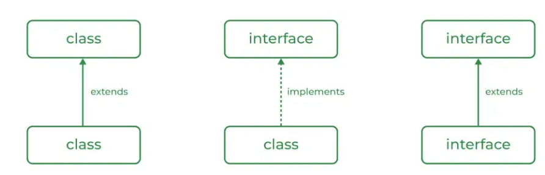
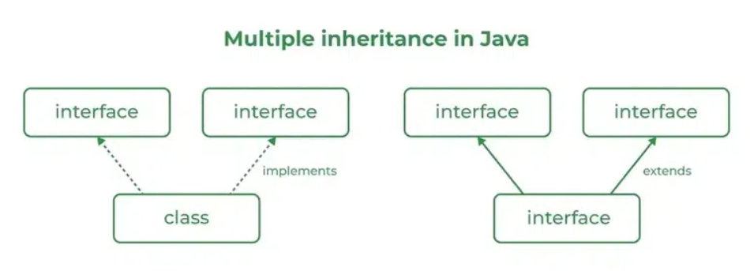

# JAVA

## POP vs OOP in Java: A Comparison

| Feature              | Procedural Oriented Programming (POP)    | Object Oriented Programming (OOP)                  |
|----------------------|------------------------------------------|----------------------------------------------------|
| **Focus**            | Functions and procedures                 | Objects and their interactions                     |
| **Structure**        | Top-down approach                        | Bottom-up approach                                 |
| **Data & Functions** | Separated, data can be accessed globally | Encapsulated within objects                        |
| **Data Access**      | Global access, less secure               | Restricted access through methods, more secure     |
| **Reusability**      | Low, code duplication is common          | High, inheritance and polymorphism promote reuse   |
| **Extensibility**    | Difficult to extend or modify code       | Easier to extend with inheritance and polymorphism |
| **Maintainability**  | Difficult to maintain large codebases    | Easier to maintain due to modularity               |
| **Examples**         | C, FORTRAN                               | Java, C++, Python                                  |


## Understanding the Java Ecosystem: JDK, JRE, JVM and JIT

### Java Development Kit (JDK)

*   **Definition:** The JDK is a comprehensive software development kit that provides everything you need to develop, debug, and run Java applications.
*   **Components:**
    *   **Java Runtime Environment (JRE):** Used to run Java applications.
    *   **Development Tools:**
        *   **javac:** Java compiler to convert Java source code into bytecode.
        *   **java:** Java interpreter to execute Java bytecode.
        *   **jar:** Utility for packaging Java classes into JAR (Java Archive) files.
        *   **javadoc:** Generates API documentation from Java source code.
        *   **Debugger:** Helps identify and fix errors in your code.
*   **Who needs it?:** Anyone who wants to develop Java applications.

### Java Runtime Environment (JRE)

*   **Definition:** The JRE is a software environment that provides the minimum requirements for running compiled Java applications.
*   **Components:**
    *   **Java Virtual Machine (JVM):** Interprets and executes Java bytecode.
    *   **Core Libraries:** Provides essential functionalities like input/output, networking, and collections.
*   **Who needs it?:** Anyone who wants to run Java applications on their system.

### Java Virtual Machine (JVM)

*   **Definition:** The JVM is an abstract computing machine that enables a computer to run Java programs. It is the core component of the JRE and is responsible for interpreting and executing Java bytecode.
*   **Key Features:**
    *   **Platform Independence:** Allows Java applications to run on any system with a compatible JVM, regardless of the underlying operating system. (Write Once, Run Anywhere)
    *   **Automatic Memory Management:** Handles memory allocation and reallocation, reducing the risk of memory leaks.
    *   **Security:** Provides a secure environment for running Java applications.
*   **Who needs it?:** Developers don't directly interact with the JVM. It's automatically used when running Java applications through the JRE.

### Just In Time Compiler (JIT)
* The JVM includes a Just-In-Time compiler that dynamically translates bytecode into native machine code at runtime. This optimization process tailors the execution to the specific platform, enhancing performance while preserving platform independence.


### Relationship between JDK, JRE, JVM and JIT
*   **JDK:** Contains the JRE and additional development tools.
*   **JRE:** Contains the JVM and core libraries needed to run Java applications.
*   **JIT:** Convert java code to native Machine code (Java Bytecode)
*   **JVM:** The core component of the JRE that executes Java bytecode.

### Summary

*   **Develop Java Applications:** Use the JDK.
*   **Run Java Applications:** Use the JRE.
*   **Execute Java Bytecode:** The JVM does this within the JRE.

### Difference 

| Component                          | Description                                                               | Includes                                           |
|------------------------------------|---------------------------------------------------------------------------|----------------------------------------------------|
| **JDK (Java Development Kit)**     | A complete development environment for building Java applications.        | JRE + Development tools (compiler, debugger, etc.) |
| **JRE (Java Runtime Environment)** | Provides the minimum requirements for running compiled Java applications. | JVM + Core libraries (e.g., java.lang, java.util)  |
| **JVM (Java Virtual Machine)**     | Interprets and executes Java bytecode, providing platform independence.   | -                                                  | 

---
## Functions

### Types of functions: -
* No Return type—No Argument++
* With Return type—No Argument
* No Return type—With Argument
* With a Return type—With Argument

### To Call Method: -
Function_Name();

### Rules For Return Type: -
1. The Line Of Code After the Return Statement will not execute.
2. Return statements will not be allowed in the loop.
3. Return Statement Will Return Only One Value.

### Method OverLoading: -
1. You can change parameters When you have the same return type.
2. If the number of parameters is the same, we need to change the datatype.
3. You cannot just change the datatype of the arguments keeping the return type and the number of arguments the same for two methods.
---

## Constructor:-
1. Constructor should be the same name as the class name
2. There is no return type.
3. You can call a method inside the constructor.
4. We can use access Modifiers.
5. The constructor cannot be defined inside the constructor.

### Copy constructor
Here when we assign a constructor value, a constructor then it copies a constructor value to another.
#### Example: -
``` 
Constructor c = new Constructor();
Constructor c2 = new Constructor();
c2 = c;
``` 
---

### Difference between Method and construction
| Method                                                                                                    | Constructor                                                                             |
|-----------------------------------------------------------------------------------------------------------|-----------------------------------------------------------------------------------------|
| User can decide The method name.                                                                          | Construction name and class name should be the same.                                    |
| Method needs to be explicitly called.                                                                     | The construction is called implicitly during the object creation.                       |
| Method has a return type.                                                                                 | Construction has no return type.                                                        |
| We can call a method in the constructor.                                                                  | You cannot call the constructor inside the constructor.                                 |
| When the method has the same name, it is method overloading we need to change the return type/parameters. | In construction, overloading with only different parameters.                            |
| A method is used to expose behaviour of object                                                            | it is used to initialize state of object                                                |
| It is not provided by compiler in any case                                                                | java compiler provides a default constructor if you don't have any constructor in class |
| They are inherited by subclass                                                                            | they are not inherited by subclass                                                      |
| The constructor is never static or final                                                                  | A method can be static or final                                                         |

---

## Exception :-
In Java, an Exception is an unwanted or unexpected event, which occurs during the execution of a program, i.e., at run time, that disrupts the normal flow of the program’s instructions. Exceptions can be caught and handled by the program. When an exception occurs within a method, it creates an object. This object is called the exception object. It contains information about the exception, such as the name and description of the exception and the state of the program when the exception occurred.

### Major reasons why an exception Occurs
* Invalid user input
* Device failure
* Loss of network connection
* Physical limitations (out-of-disk memory)
* Code errors
* Opening an unavailable file

### Exception Handling: -
It is used to handle exceptions using try-catch.

```
try{ 
    //code
}
Catch(ExceptionObjecct eo){ 
    //code
}
Final{ 
    //code
}
```
#### Example:-

```
    int a=10 , b = 5 , c = 5;
    try{
       int x = a/(b-c);
    }
    catch(arithmeticexception e){
       System.out.println("divide by zero .");
    }
       int y = a/(b+c)
       System.out.println(y)
```
So In Java Errors that cannot be handled by the user or programmer

Ex:—       
Virtual matching error, Stack Overflow, Out of Memory error, etc.

### Types of exceptions: -
1. IO Exception
2. SQLException
3. ClassNotFoundException
4. RuntimeException:—      
     1. ArithmeticException   
     2. NullPointerException   
     3. NumberFormetException       
     4. StringIndexException
     5. IndexOutOfBoundException  
        1) ArrayIndexOutOfBounds
        2) StringIndexOutOfBounds

### WRITE A PROGRAM USING MULTIPLE CATCH BLOCKS.

        try{

        }
        Catch(ExceptionObjecct eo){

        }Catch(ExceptionObjecct eo){

        }Catch(ExceptionObjecct eo){

        }
        Final{

        }

### Unchecked Exception: -
Exception predicted by the programmer, and it will handle at compile time.

### Checked Exception: -
Exception it will check at run time error.
It is comparable to handle check exceptions in the compiler.
Compiler tails it may be possible to come error at run time that the file has not found an exception,
so it is comparable to handle check exception.
We can handle check exceptions in two ways
1. Using Try Catch Block
2. Using throws keyword.

#### Example:-
// Using Try-Catch Block
``` 
try {
    Printwriter pw = new Printwriter("abc.txt");
}catch(FilenotfoundException e){
    System.out.println("File Not Found.."+e.getMessage());
}
```

### Usage of Throws Keyword: -
* Throws keyword is used for checked exceptions.
* We can declare exceptions with the method signature using the throw keyword.
* We can declare multiple exceptions using the throw keyword.
* We can handle multiple exceptions at a time.
* throws Keyword Delegate the responsibility of exception handling to caller method.

### Syntax:-

    return_type method_Name() throws exception_class_Name{}

### Example:-

    public static void main(String[] args) throws FileNotFoundException , ClassNotFoundException{
        Printwriter pw = new Printwriter("abc.txt");
    }


## Throw and Throws in Java:
> Both `throw` and `throws` keywords in Java are crucial for exception handling, but they serve distinct purposes.
Let's break down their functionalities:

### Throw Keyword

*   **Purpose:** Used to explicitly throw an exception within a method or block of code.
*   **Syntax:**
    ```
    throw new ExceptionType("Optional message describing the exception");
    
    ```
*   **Explanation:**

    *   You can use `throw` with any throwable object (e.g., Exception, RuntimeException, or custom exception classes).
    *   When an exception is thrown, the normal flow of execution stops, and the control is transferred to the nearest matching `catch` block in the call stack.
    *   If no matching `catch` block is found, the program terminates abnormally.
*   **Example:**

```
public void checkAge(int age) {
if (age < 18) {
throw new ArithmeticException("Access denied - You must be at least 18 years old.");
}
// ... rest of the code ...
}

```

In this example, if the `age` is less than 18,
the `checkAge` method throws an `ArithmeticException` with a descriptive message.

### Throws Keyword

*   **Purpose:** Used in a method signature to declare the types of exceptions that the method might throw.
*   **Syntax:**
```
returnType methodName(parameters) throws ExceptionType1, ExceptionType2 {
// ... method body ...
}

```

*   **Explanation:**
    *   `throws` acts as a contract, informing the caller of the method about potential exceptions they need to handle.
    *   If a checked exception (exceptions that are not subclasses of `RuntimeException`) is thrown within the method, it must be declared using `throws`.
    *   Unchecked exceptions (subclasses of `RuntimeException`) do not need to be declared, but it can be helpful for documentation purposes. 
* **Example:**
```
public void readFile(String fileName) throws IOException {
    // Code to open and read the file...
    // ... which might throw an IOException
}
```
Here, `readFile` declares that it might throw an `IOException`.
Any code calling `readFile` must either handle the exception using a `try-catch` block
or further declare it using `throws` in its own signature.

### Key Differences between Throw and Throws
| Feature                  | Throw                                                                                                                                                                          | Throws                                                                                                                      |
|--------------------------|--------------------------------------------------------------------------------------------------------------------------------------------------------------------------------|-----------------------------------------------------------------------------------------------------------------------------|
| **Purpose**              | To explicitly raise an exception at a specific point in the code.                                                                                                              | To signal that a method might throw an exception.                                                                           |
| **Placement**            | Inside a method body.                                                                                                                                                          | In the method signature.                                                                                                    |
| **Syntax**               | `throw new ExceptionType("Error message");`                                                                                                                                    | `returnType methodName(parameters) throws ExceptionType1, ExceptionType2, ...`                                              |
| **Exception Handling**   | Requires a try-catch block to handle the exception within the same method or a throws declaration to propagate it to the calling method.                                       | Informs the calling method that it needs to handle the potential exception using a try-catch block or further propagate it. |
| **Number of Exceptions** | Throws a single exception at a time.                                                                                                                                           | Can list multiple potential exception types.                                                                                |
| **Example**              | void readFile(String filename){<br/>if (filename == null) {<br/>throw new IllegalArgumentException("Filename cannot be null");<br/>}  <br/>  // Code to read the file...<br/>} | void processFile(String filename) throws IOException {<br/> // May throw IOException <br/>}                                 |

### Choosing Between Throw and Throws

*   Use `throw` when you want to explicitly stop the normal execution flow and handle an exceptional situation.
*   Use `throws` to indicate potential exceptions that a method might throw but doesn't handle itself, delegating the responsibility to the calling code.

> In conclusion, both `throw` and `throws` are essential for writing robust and maintainable Java code by effectively handling exceptions and providing clear information about potential error conditions.


## User-Defined Exceptions in Java
> In Java, you can create your own exception types by extending the `Exception` class or one of its subclasses.
This allows you to define specific exceptions for your application, making error handling more precise and informative.

### Defining a Custom Exception Class

Here's the basic structure for defining a user-defined exception:

```
public class MyCustomException extends Exception {

    // Constructor that calls the superclass constructor
    public MyCustomException(String message) {
        super(message);
    }

    // Optional: additional constructors or methods
}

```

#### Explanation:

*   **`MyCustomException`**: Replace this with the name of your exception class.
*   **`extends Exception`**: This indicates that your class inherits from the `Exception` class, making it a checked exception. If you want to create an unchecked exception, extend `RuntimeException` instead.
*   **Constructor**: You can define constructors to initialize the exception object with specific details, such as an error message.

### Example:

Let's create a custom exception called `InvalidAgeException` that will be thrown when an invalid age is entered
(e.g., a negative age):

```
public class InvalidAgeException extends Exception {

    public InvalidAgeException(String message) {
        super(message);
    }
}

```

### Using the Custom Exception

Now, let's use `InvalidAgeException` in a method that validates age:

```
public void checkAge(int age) throws InvalidAgeException {
if (age < 0) {
throw new InvalidAgeException("Age cannot be negative: " + age);
}
// ... rest of the code
}

```

**Explanation:**

1.  **`throws InvalidAgeException`**: This declaration indicates that the `checkAge` method might throw an `InvalidAgeException`.
2.  **`throw new InvalidAgeException(...)`**: If the age is invalid (negative), we create a new `InvalidAgeException` object with an appropriate error message and throw it.

### Handling the Exception

When calling the `checkAge` method, you need to handle the potential `InvalidAgeException` using a `try-catch` block:

```
try {
checkAge(-5);
} catch (InvalidAgeException e) {
System.err.println("Error: " + e.getMessage());
}

```

This code will catch the `InvalidAgeException` and print the error message to the console.

### Advantages of User-Defined Exceptions

*   **Clarity**: They provide specific information about the type of error that occurred, making the code more readable and easier to debug.
*   **Flexibility**: You can tailor exceptions to your application's needs, including adding custom fields or methods to hold relevant data.
*   **Maintainability**: By defining specific exception types, you can centralize error handling logic and improve code organization.


---
## Access modifiers


| Access Modifier                 | Class | Package | Subclass | World | Description                                                                                                                     |
|---------------------------------|-------|---------|----------|-------|---------------------------------------------------------------------------------------------------------------------------------|
| `public`                        | Yes   | Yes     | Yes      | Yes   | Accessible from anywhere. There are no restrictions on access.                                                                  |
| `protected`                     | Yes   | Yes     | Yes      | No    | Accessible within the same class, package, and subclasses (even if the subclass is in a different package).                     |
| `no modifier` (package-private) | Yes   | Yes     | No       | No    | Accessible within the same class and package, but not from subclasses or outside the package.                                   |
| `private`                       | Yes   | No      | No       | No    | Accessible only within the same class. Not accessible from anywhere else, including subclasses or even within the same package. |

---
## Wrapper Class
* Java support-only calls by value, so we use a wrapper class.    
* Used to create a Reference of a variable.   
* It is used to provide a mechanism to convert primitive into object and object into primitive.   
* It has two types
  1. Autoboxing
  2. Unboxing

| Feature             | Autoboxing                                                                                          | Unboxing                                                                                          |
|---------------------|-----------------------------------------------------------------------------------------------------|---------------------------------------------------------------------------------------------------|
| **Definition**      | Automatic conversion of primitive types to their corresponding wrapper objects.                     | Automatic conversion of wrapper objects to their corresponding primitive types.                   |
| **Process**         | The compiler implicitly creates a wrapper object for the primitive type.                            | The compiler implicitly extracts the primitive value from the wrapper object.                     |
| **Example**         | `int i = 10; Integer obj = i;`                                                                      | `Integer obj = 10; int i = obj;`                                                                  |
| **Purpose**         | Simplifies code by eliminating the need to explicitly create wrapper objects.                       | Allows direct use of primitive values from wrapper objects without explicit conversion.           |
| **Performance**     | May introduce slight overhead due to object creation.                                               | Generally more efficient than explicit casting.                                                   |
| **Usage Scenarios** | - Collections (which require objects) - Generics - Method parameters/return types requiring objects | - Arithmetic operations - Assignments to primitive variables - Comparisons using primitive values |

> **Note:** While autoboxing and unboxing provide convenience, it's essential to be mindful of potential performance implications and null values when working with wrapper objects.

### uses
1. Change the value in the method
2. Serialization
3. Synchronization

### Example:-
``` 
int a = 20;
Integer i = Integer.valueOf(a);
Integer j = a; // autoboxing
Integer a = new Integer(3);
int i = a.intValue(); //Explicit
```
### method in a string wrapper class


| No. | Method                                                                                | Description                                                          |
|-----|---------------------------------------------------------------------------------------|----------------------------------------------------------------------|
| 1   | char charAt(int index)                                                                | It returns char value for the particular index.                      |
| 2   | int length()                                                                          | It returns string length                                             |
| 3   | static String format(String format, Object... args)                                   | It returns a formatted string                                        |
| 4   | static String format(Locale I, String format, Object... args)                         | It returns formatted string with given locale.                       |
| 5   | String substring(int beginIndex)                                                      | It returns substring for given begin index.                          |
| 6   | String substring(int beginIndex, int endIndex)                                        | It returns substring for given begin index and end index.            |
| 7   | boolean contains(CharSequence s)                                                      | It returns true or false after matching the sequence of char value.  |
| 8   | static String join(CharSequence delimiter, CharSequence... elements)                  | It returns a joined string                                           |
| 9   | static String join(CharSequence delimiter, Iterable<? extends CharSequence> elements) | It return joined String                                              | 
| 10  | boolean equals(Object another)                                                        | It checks the equality of string with the given object.              |
| 11  | boolean isEmpty()                                                                     | It checks if string is empty.                                        |
| 12  | String concat(String str)                                                             | It concatenates the specified string.                                | 
| 13  | String replace(char old, char new)                                                    | It replaces all occurrences of the specified char value.             | 
| 14  | String replace(CharSequence old, CharSequence new)                                    | It replaces all occurrences of the specified CharSequence.           | 
| 15  | static String equalsIgnoreCase(String another)                                        | It compares another string. It doesn't check case.                   |
| 16  | String[] split(String regex)                                                          | It returns a split string matching regex.                            |
| 17  | String[] split(String regex, int limit)                                               | It returns a split string matching regex and limit.                  |
| 18  | int indexOf(int ch)                                                                   | It returns the specified char value index.                           |
| 19  | int indexOf(int ch, int fromIndex)                                                    | It returns the specified char value index starting with given index. | 
| 20  | int indexOf(String substring)                                                         | It returns the specified substring index.                            | 
| 21  | int indexOf(String substring, int fromIndex)                                          | It returns the specified substring index starting with given index.  |
| 22  | String toLowerCase()                                                                  | It returns a string in lowercase.                                    | 
| 23  | String toLowerCase(Locale I)                                                          | It returns a string in lowercase using specified locale.             |
| 24  | String toUpperCase()                                                                  | It returns a string in uppercase.                                    | 
| 25  | String toUpperCase(Locale I)                                                          | It returns a string in uppercase using specified locale.             |
| 26  | String trim()                                                                         | It removes beginning and ending spaces of this string.               |
| 27  | static String valueOf(int value)                                                      | It converts given type into string. It is an overloaded method.      | 


> The object or variable of a string class will never be changed even if you contact replace trim or any operation to it To save the updated screen after these operations You need to create another variable or object of the string class.

### Example of string class methods
``` 
// length()
"Nimesh".length();  // returns 6

// charAt()
"Nimesh".charAt(3); // returns  ‘m’

// contains
"nim".concat("esh"); // returns “nimesh”

// replace
String s1 = “Nimesh“;
String s2 = “Nimesh”.replace(‘N’ ,’g’); // returns “gimesh”

// equals
“Nimesh”.equals(“Nimesh”); // returns true
“Nimesh”.equals(“nimesh”); // returns false

// equalsIgnoreCase
“Nimesh”.equalsIgnoreCase(“Nimesh”); // returns true
“Nimesh”.equalsIgnoreCase(“nimesh”); // returns true

// ___.toLowerCase();
"NiMeSh".toLowerCase(); // return "nimesh"

// ___.toUpperCase();
"nImEsH".toUpperCase(); // return "NIMESH"

--- For advance ---

// substring()
"Nimesh".substring(3); // returns “mesh”
"nimesh".substring(2, 5); // returns “mes” == [2,5)
// 2 is inclusive and 5 is exclusive

//index of
String s = ”Learn Share Learn”;
int output = s.indexOf(“Share”); // returns 6
// return -1 if it can't find it 
// if we put location > length then it generate IndexOutOfBounds exception 
```

---

### Difference between `String` vs `StringBuffer`
| String                                                                                                                                                                        | String Buffer                                                                                                  |
|-------------------------------------------------------------------------------------------------------------------------------------------------------------------------------|----------------------------------------------------------------------------------------------------------------|
| The string class objects are immutable.                                                                                                                                       | The string Buffer class objects are mutable.                                                                   |
| String Class objects holds its string length you can not change its size.                                                                                                     | In StringBuffer Class objects you can change its size.                                                         |
| You can concat the string string with other string and replace the characters of the string at a given position but you can not insert a character sequence amidst the string | You can insert a character sequence in a string buffer object retaining the original characters in the string. |
| You can not delete any character from a string class object.                                                                                                                  | You can delete any character from a string Buffer class object which also adjust the …                         |
| String class object need to be type case explicitly to use string Buffer class methods                                                                                        | String Buffer class object can use string class methods directly                                               |
| You don't need a any object to initialize a variable.                                                                                                                         | You comparably need a object to initialize a variable.                                                         |

> You can convert a string class object into a string buffer object to access the methods of string buffer class. You cannot directly pass a string to a string buffer object.

### String Buffer Methods

| Methods          | Action Performed                                                            |
|------------------|-----------------------------------------------------------------------------|
| append()         | Used to add text at the end of the existing text.                           |
| length()         | The length of a StringBuffer can be found by the length() method            |
| capacity()       | the total allocated capacity can be found by the capacity() method          |
| charAt()         | This method returns the char value in this sequence at the specified index. |
| delete()         | Deletes a sequence of characters from the invoking object                   |
| deleteCharAt()   | Deletes the character at the index specified by the loc                     |
| ensureCapacity() | Ensures capacity is at least equal to the given minimum.                    |
| insert()         | Inserts text at the specified index position                                |
| length()         | Returns the length of the string                                            |
| reverse()        | Reverse the characters within a StringBuffer object                         |
| replace()        | Replace one set of characters with another set inside a StringBuffer object | 

#### Example:
``` 
StringBuffer sb = new StringBuffer("Hello");

sb.append(" World !"); // now sb = "Hello World"

sb.reverse(); // now sb = "dlroW olleH"

sb.length(); // return = 11

sb.insert(1,"java"); // return = "djavalroW olleH" //insert before the index (Won't delete)

sb.replace(1,5,""); // return = "dlroW olleH" // insert at the index (delete it)

sb.delete(0,5);// return = " olleH"

//When we create a string buffer object it allocates some capacity = 16
sb.capacity(); // return = 21 + length == 

```

---

### Difference between Character and String

| Character (char)              | String (java.lang.String)     |
|-------------------------------|-------------------------------|
| Primitive                     | Class                         |
| 2 bytes                       | Variable (depends on content) |
| `char c = 'a';`               | `String s = "hello";`         |
| Single character              | Sequence of characters        |
| `==` operator for compression | `.equals()` method            |
| Direct access                 | Methods like `charAt()`       |
| White space is ignored        | White space it not ignored    |
| Has `Character` wrapper class | it self is a wrapper class    |

---

## Abstraction in Java: A Guide in Markdown Format

Abstraction is a core principle in object-oriented programming, and Java provides robust mechanisms to implement it.
Let's explore the concept of abstraction and its implementation in Java.

### What is Abstraction?

Abstraction refers to the process
of hiding the internal details of how things work and exposing only the essential information to the user.
It focuses on what an object does instead of how it does it.

Think of a TV remote; you know the buttons to change channels or volume,
but you don't necessarily understand the complex electronics inside that make it work.
This is an abstraction in action.

### Benefits of Abstraction in Java:

* **Simplicity**: Makes code easier to understand and use by hiding complexity.
* **Flexibility**: Allows for easy modification of internal implementation without affecting user interaction.
* **Maintainability**: Simplifies code maintenance and reduces the impact of changes.
* **Reusability**: Promotes code reuse by creating generic components applicable in different scenarios.

### Implementing Abstraction in Java:

Java provides two primary ways to achieve abstraction:

* **Abstract classes**: Classes defined with the `abstract` keyword, containing both abstract methods (without implementation) and concrete methods (with implementation).
* **Interfaces**: Completely abstract types that define method signatures without any implementation. They specify the behavior a class must implement.

#### Abstract Classes:

1. **Defining an abstract class:**

    ```
    public abstract class Shape {
    public abstract double area();
    public abstract double perimeter();
    
           public void printInfo() {
               System.out.println("This is a shape.");
           }
    }
    ```
2. **Creating concrete classes:**

    ```
    public class Circle extends Shape {
    private double radius;
           // Constructor and other methods...
           @Override
           public double area() {
               return Math.PI * radius * radius;
           }
           @Override
           public double perimeter() {
               return 2 * Math.PI * radius;
       }
    }
    ```

#### Interfaces:

1. **Defining an interface:**
    ```
    public interface Drawable {
        void draw();
    }
    ```
2. **Implementing the interface:**

    ```
    public class Circle implements Drawable {
    // ...
    
           @Override
           public void draw() {
               // Code to draw a circle
           }
    }
    ```

### Key Differences: Abstract Class vs. Interface:

| Feature          | Abstract Class                              | Interface                                                 |
|------------------|---------------------------------------------|-----------------------------------------------------------|
| Implementation   | Can have both abstract and concrete methods | Only abstract methods (with default methods since Java 8) |
| Inheritance      | Extends (single inheritance)                | Implements (multiple inheritance)                         |
| Member Variables | Can have member variables                   | Can only have constants                                   |
| Relationship     | "is-a" relationship                         | "can-do" relationship                                     |

### Choosing Between Abstract Class and Interface:

* **Use an abstract class:** When you want to share some implementation details and there is a clear "is-a" relationship between the classes.
* **Use an interface:** When you want to define a contract for behavior without specifying any implementation and there is a "can-do" relationship between the classes.


---

## ArrayList

**What is it?**

An ArrayList is a resizable array implementation in Java. It's part of the Java Collections Framework and is found in the `java.util` package.

**Key Points:**

* **Dynamic sizing:** Unlike traditional arrays, ArrayLists automatically grow in size as you add elements.
* **Object storage:** ArrayLists store objects, so you need to use wrapper classes (like `Integer` for `int`) when storing primitive types.
* **Index-based access:** Elements are accessed using their index, similar to arrays.
* **Methods:** ArrayLists provide various methods for adding, removing, searching, and sorting elements.
* **Synchronization:** ArrayList class is non Synchronized

**Basic Usage:**

```
// Import this
// import java.util.ArrayList;

// Create an ArrayList of Strings
ArrayList<String> names = new ArrayList<>();

// Add elements
names.add("Nimesh");
names.add("Nims");

// Access element at index 0
String firstName = names.get(0); // "Nimesh"

// Get the size of the ArrayList
int size = names.size(); // 2

// Remove the element at index 1
names.remove(1);

// Check if the ArrayList is empty
boolean isEmpty = names.isEmpty(); // false


```
**Advantages:**

* **Flexibility:** Easily add or remove elements.
* **Dynamic:** No need to predefine the size.
* **Convenience:** Offers many built-in methods for managing elements.

**Disadvantages:**

* **Performance:** Can be slower than traditional arrays for certain operations (e.g., accessing elements by index).
* **Type safety:** Requires using wrapper classes for primitive types.

**When to use ArrayLists?**

* When you need a collection that can dynamically resize.
* When you need to frequently add or remove elements.
* When you need to store objects of different types (using generics).

**Alternatives:**

* **Traditional arrays:** If you know the size of the collection beforehand and need optimal performance.
* **LinkedList:** If you frequently add or remove elements from the beginning or middle of the collection.

**ArrayList Methods in Java**

| **Method**                | **Description**                                                                                                                 |
|---------------------------|---------------------------------------------------------------------------------------------------------------------------------|
| add(E element)            | Appends the specified element to the end of the list.                                                                           |
| add(int index, E element) | Inserts the specified element at the specified position in the list.                                                            |
| remove(int index)         | Removes the element at the specified position in the list.                                                                      |
| remove(Object o)          | Removes the first occurrence of the specified element from the list, if it is present.                                          | 
| set(int index, E element) | Replaces the element at the specified position in the list with the specified element.                                          |
| get(int index)            | Returns the element at the specified position in the list.                                                                      |
| size()                    | Returns the number of elements in the list.                                                                                     |
| isEmpty()                 | Returns true if the list contains no elements.                                                                                  |
| contains(Object o)        | Returns true if the list contains the specified element.                                                                        | 
| clear()                   | Removes all of the elements from the list.                                                                                      |
| indexOf(Object o)         | Returns the index of the first occurrence of the specified element in the list, or -1 if the list does not contain the element. |
| lastIndexOf(Object o)     | Returns the index of the last occurrence of the specified element in the list, or -1 if the list does not contain the element.  | 


## ArrayList vs. Array vs. LinkedList in Java

| Feature                | ArrayList                                              | Array                                      | LinkedList                                               |
|------------------------|--------------------------------------------------------|--------------------------------------------|----------------------------------------------------------|
| **Data Structure**     | Dynamic array                                          | Fixed-size array                           | Doubly linked list                                       | 
| **Resizing**           | Automatic                                              | Manual                                     | Automatic                                                |
| **Element Access**     | O(1)                                                   | O(1)                                       | O(n)                                                     |
| **Insertion/Deletion** | O(n) at the beginning or middle, O(1) at the end       | N/A                                        | O(1) at the beginning or end, O(n) in the middle         |
| **Memory Usage**       | Less efficient due to potential resizing               | Most efficient                             | Less efficient due to extra memory needed for links      |
| **Use Cases**          | Frequent access by index, adding/removing from the end | Fixed number of elements, efficient access | Frequent insertions/deletions at the beginning or middle |


Add collection and iteration class in it with for each loop

---

## Interface

> The interface in Java is a mechanism to achieve abstraction. There can be only abstract methods in the Java interface, not the method body. It is used to achieve abstraction and multiple inheritances in Java using Interface.

### Uses of Interfaces in Java are mentioned below:

* It is used to achieve total abstraction.
* Since Java does not support multiple inheritances in the case of class, by using an interface, it can achieve multiple inheritances.
* Any class can extend only one class, but can any class implement an infinite number of interfaces.
* It is also used to achieve loose coupling.
* Interfaces are used to implement abstraction.

### Syntax
``` 
interface {
// declare constant fields
// declare methods that abstract
// by default.   
}
```

### Difference Between Class and Interface

| Class                                                                       | Interface                                                              |
|-----------------------------------------------------------------------------|------------------------------------------------------------------------|
| In class, you can instantiate variables and create an object.               | In an interface, you can’t instantiate variables and create an object. |
| A class can contain concrete (with implementation) methods                  | The interface cannot contain concrete (with implementation) methods.   |
| The access specifiers used with classes are private, protected, and public. | In Interface, only one specifier is used — Public.                     |

### Relationship Between Class and Interface



### Advantage
* Without bothering about the implementation part, we can achieve the security of the implementation.
* In Java, multiple inheritances are not allowed; however, you can use an interface to make use of it as you can implement more than one interface.

### Multiple Inheritance in Java Using Interface


### take out
* We can’t create an instance (interface can’t be instantiated) of the interface, but we can make the reference to it that refers to the Object of its implementing class.
* A class can implement more than one interface.
* An interface can extend to another interface or interface (more than one interface).
* A class that implements the interface must implement all the methods in the interface.
* All the methods are public and abstract. All the fields are public, static, and final.
* It is used to achieve multiple inheritances.
* It is used to achieve loose coupling.
* Inside the Interface is not possible to declare instance variables because by default variables are public static final.
* Inside the Interface, constructors are not allowed.
* Inside the interface, the main method is not allowed.
* Inside the interface, static, final, and private methods declaration is not possible.

### Example:

``` 
interface In1
{
    void display();
}
class TestClass implements In1
{
    public void display(){
        System.out.println("hello");
    }
    public static void main (String[] args)
    {
        TestClass t = new TestClass();
        t.display();
    }
}
```
---

## Difference between Upcasting and Downcasting

| Feature                | Upcasting                                                                                                    | Downcasting                                                                                           |
|------------------------|--------------------------------------------------------------------------------------------------------------|-------------------------------------------------------------------------------------------------------|
| **Concept**            | Treating a more specific type as a more general type.                                                        | Treating a more general type as a more specific type.                                                 |
| **Direction**          | Moving **up** the inheritance hierarchy.                                                                     | Moving **down** the inheritance hierarchy.                                                            |
| **Implicit/Explicit**  | Implicit (automatic) - No explicit casting needed.                                                           | Explicit - Requires a cast operator `(TargetType)`.                                                   |
| **Safety**             | Safer as it's guaranteed to succeed.                                                                         | Risky - Can throw a `ClassCastException` if the object isn't of the target type.                      |
| **Example**            | `Animal animal = new Dog();`  (Dog is a type of Animal)                                                      | `Dog dog = (Dog) animal;` (Assuming `animal` references a Dog object)                                 |
| **Use Cases**          | Polymorphism, treating objects of different types uniformly.                                                 | Accessing specific methods/properties of a subclass.                                                  | 
| **Things to remember** | - The object's actual type remains unchanged.  - Access is limited to members defined in the reference type. | - Always check the object's type before downcasting using `instanceof` to avoid `ClassCastException`. |

---

## `instanceof` operator in Java
* This operator returns either true or false and hence is majorly used in conditional statements.
* it is used to check whether a given object belongs to a particular class or not.
* an object of subclass is also an instanceof parent class.
``` 
class Parent {
}
class Child extends Parent {
} 
class Test {
    public static void main(String[] args)
    {
        Parent pobj = new Parent();
        if (pobj instanceof Child)
            System.out.println("pobj is instance of Child");
        else
            System.out.println("pobj is NOT instance of Child");
    }
}
```

---

## Inheritance 

### Introduction

Inheritance is a fundamental concept in object-oriented programming (OOP) that allows you to create new classes (subclasses) based on existing ones (superclasses). This promotes code reusability and a hierarchical structure, where subclasses inherit the properties and methods of their superclasses, while also adding their own unique features.

### Key Terminology

* **Superclass/Parent Class:** The class from which another class inherits.
* **Subclass/Child Class:** The class that inherits from a superclass.
* **Extends Keyword:** Used to indicate that a subclass inherits from a superclass.
* **IS-A Relationship:** A subclass IS-A type of its superclass.

### Syntax

```
class Subclass extends Superclass {
// Subclass members
}
```

### Example

```
// Superclass (Parent Class)
class Animal {
String name;

    void eat() {
        System.out.println(name + " is eating.");
    }
}

// Subclass (Child Class)
class Dog extends Animal {
void bark() {
System.out.println(name + " is barking.");
}
}

public class Main {
public static void main(String[] args) {
Dog myDog = new Dog();
myDog.name = "Buddy";
myDog.eat();  // Inherited from Animal class
myDog.bark(); // Specific to Dog class
}
}
```

**Output:**

```
Buddy is eating.
Buddy is barking.
```

### Types of Inheritance

* **Single Inheritance:** A subclass inherits from only one superclass. (e.g., Dog inherits from Animal)
* **Multilevel Inheritance:** A subclass inherits from a superclass, which in turn inherits from another superclass, creating a hierarchy. (e.g., BabyDog inherits from Dog, which inherits from Animal)
* **Hierarchical Inheritance:** Multiple subclasses inherit from a single superclass. (e.g., Dog and Cat both inherit from Animal)
* **Note:** Java does not support multiple inheritance (a subclass inheriting directly from multiple superclasses) to avoid ambiguity and complexity.

### Advantages of Inheritance

* **Code Reusability:** Avoids code duplication by inheriting members from the superclass.
* **Extensibility:** Easily extend existing functionality by creating subclasses with additional features.
* **Maintainability:** Changes made to the superclass automatically reflect in subclasses, making code easier to maintain.

### Important Points

* **Constructors:** Subclasses do not inherit constructors from superclasses. You need to explicitly call the superclass constructor using `super()` within the subclass constructor.
* **Method Overriding:** Subclasses can override inherited methods to provide their own implementation.
* **Access Modifiers:** Inheritance rules apply to access modifiers (`private`, `protected`, `public`).


