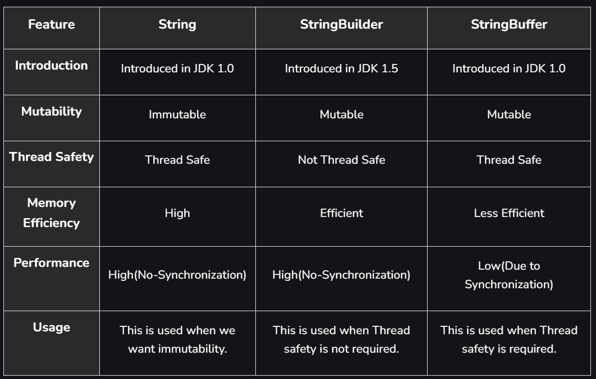
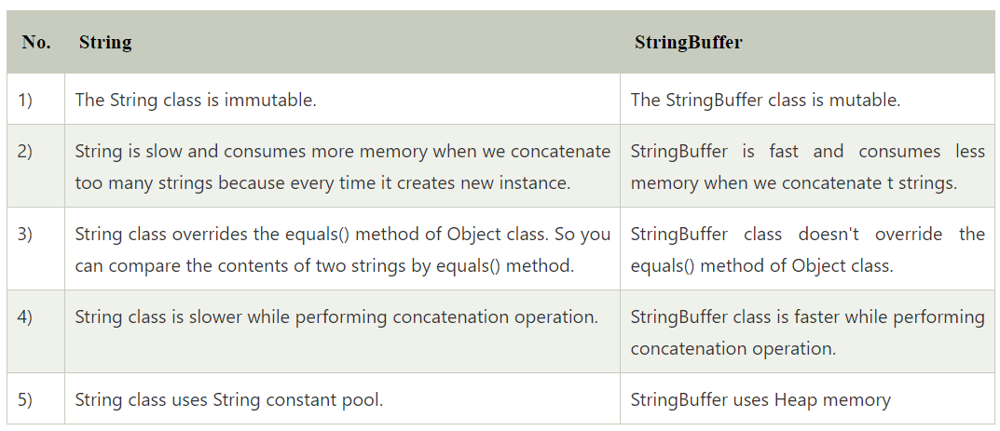
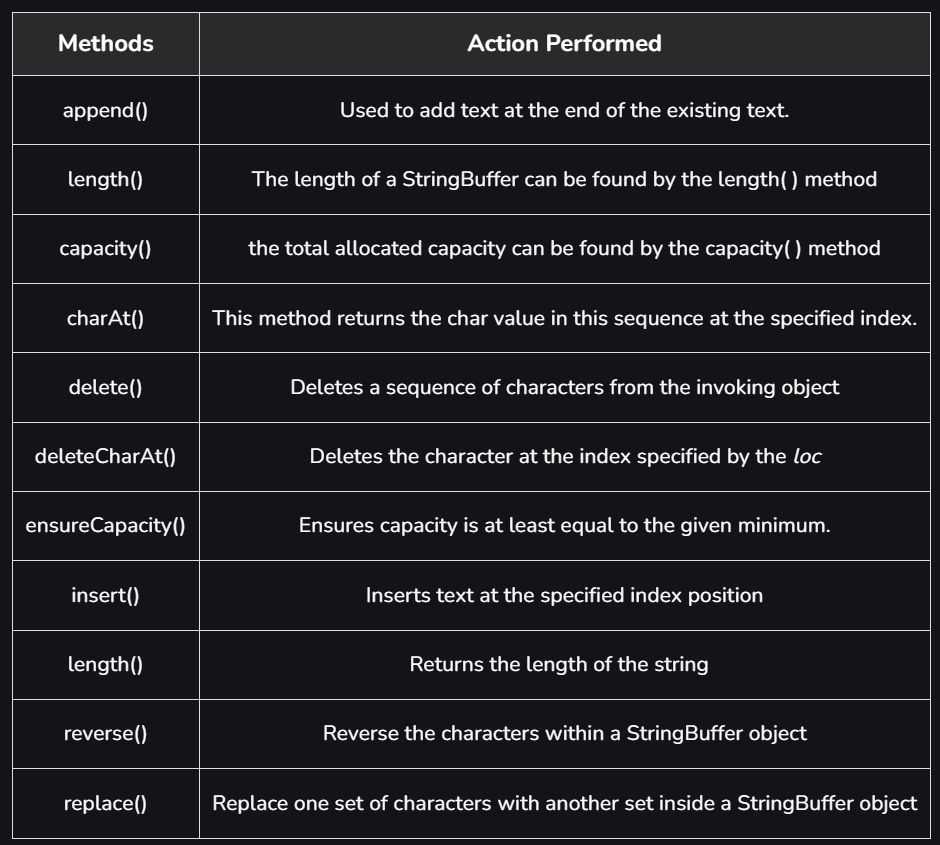

access_specifier static/nonstatic return type method_name(Arguments)
---

## Functions
### Types of functions: -
* No Return type—No Argument++
* With Return type—No Argument
* No Return type—With Argument
* With a Return type—With Argument

### To Call Method: -
Function_Name();

### Rules For Return Type: -
1. The Line Of Code After the Return Statement will not execute.
2. Return statements will not be allowed in the loop.
3. Return Statement Will Return Only One Value.

### Method OverLoading: -
1. You can change parameters When you have the same return type.
2. If the number of parameters is the same, we need to change the datatype.
3. You cannot just change the datatype of the arguments keeping the return type and the number of arguments the same for two methods.
---

## Constructor:-
1. Constructor should be the same name as the class name
2. There is no return type.
3. You can call a method inside the constructor.
4. We can use access Modifiers.
5. The constructor cannot be defined inside the constructor.

### Copy constructor
Here when we assign a constructor value, a constructor then it copies a constructor value to another.
#### Example: -
``` 
Constructor c = new Constructor();
Constructor c2 = new Constructor();
c2 = c;
``` 
---

### Difference between Method and construction

#### Method:-
* User can decide The method name.
* Method needs to be explicitly called.
* Method has a return type.
* We can call a method in the constructor.
* When the method has the same name, it is method overloading we need to change the return type/parameters.

#### Constructor:-
* Construction name and class name should be the same.
* The construction is called implicitly during the object creation.
* Construction has no return type.
* You cannot call the constructor inside the constructor.
* In construction, overloading with only different parameters.
* Non-parameter constructor is not Always default construction.
* Every default constructor should be non-parameter.
---

## Exception :-
In Java, an Exception is an unwanted or unexpected event, which occurs during the execution of a program, i.e., at run time, that disrupts the normal flow of the program’s instructions. Exceptions can be caught and handled by the program. When an exception occurs within a method, it creates an object. This object is called the exception object. It contains information about the exception, such as the name and description of the exception and the state of the program when the exception occurred.

### Major reasons why an exception Occurs
* Invalid user input
* Device failure
* Loss of network connection
* Physical limitations (out-of-disk memory)
* Code errors
* Opening an unavailable file

### Exception Handling: -
It is used to handle exceptions using try-catch.

```
try{ 
    //code
}
Catch(ExceptionObjecct eo){ 
    //code
}
Final{ 
    //code
}
```
#### Example:-

```
class demo{
public static void main(String[] args){
    int a=10 , b = 5 , c = 5;
    try{
       int x = a/(b-c);
    }
    catch(arithmeticexception e){
       sout("divide by zero .");
    }
       int y = a/(b+c)
       sout(y)
    }
}
```
So In Java Errors that cannot be handled by the user or programmer

Ex:—       
Virtual matching error, Stack Overflow, Out of Memory error, etc.

### Types of exceptions: -
1. IO Exception
2. SQLException
3. ClassNotFoundException
4. RuntimeException: -
5. ArithmeticException
6. NullPointerException
7. NumberFormetException
8. IndexOutOfBoundException
9. StringIndexException
10. ETC...

### WRITE A PROGRAM USING MULTIPLE CATCH BLOCKS.

        try{

        }
        Catch(ExceptionObjecct eo){

        }Catch(ExceptionObjecct eo){

        }Catch(ExceptionObjecct eo){

        }
        Final{

        }

### Unchecked Exception: -
Exception predicted by the programmer, and it will handle at compile time.

### Checked Exception: -
Exception it will check at run time error.
It is comparable to handle check exceptions in the compiler.
Compiler tails it may be possible to come error at run time that the file has not found an exception,
so it is comparable to handle check exception.
We can handle check exceptions in two ways
1. Using Try Catch Block
2. Using throws keyword.

#### Example:-
// Using Try-Catch Block
``` 
try {
    Printwriter pw = new Printwriter("abc.txt");
}catch(FilenotfoundException e){
    sout("File Not Found.."+e.getMessage());
}
```

### Usage of Throws Keyword: -
* Throws keyword is used for checked exceptions.
* We can declare exceptions with the method signature using the throw keyword.
* We can declare multiple exceptions using the throw keyword.
* We can handle multiple exceptions at a time.
* throws Keyword Delegate the responsibility of exception handling to caller method.

### Syntax:-

    return_type method_Name() throws exception_class_Name{}

### Example:-

    public static void main(String[] args) throws FileNotFoundException , ClassNotFoundException{
        Printwriter pw = new Printwriter("abc.txt");
    }

---
## Access modifiers
### Private
Can't access it outside the class,    
we need to get help from public modifiers to access it!

### Public
Can access outside the class

---
## Wrapper Class
> Java support-only calls by value, so we use a wrapper class.    
> Used to create a Reference of a variable.   
> It is used to provide a mechanism to convert primitive into object and object into primitive.   
> It has two types

### 1. Autoboxing
>Primitive to object       
>The automatic conversion of a primitive data type into its corresponding wrapper class

### 2.Unboxing
>Object to primitive

### uses
1. Change the value in the method
2. Serialization
3. Synchronization

### Example:-
``` 
int a = 20;
Integer i = Integer.valueOf(a);
Integer j = a; // autoboxing
Integer a = new Integer(3);
int i = a.intValue(); //Explicit
```
### method in a string wrapper class


> The object or variable of a string class will never be changed even if you contact replace trim or any operation to it To save the updated screen after these operations You need to create another variable or object of the string class.

### Example of string class methods
``` 
// length()
"Nimesh".length();  // returns 6

// charAt()
"Nimesh".charAt(3); // returns  ‘m’

// contains
"nim".concat("esh"); // returns “nimesh”

// replace
String s1 = “Nimesh“;
String s2 = “Nimesh”.replace(‘N’ ,’g’); // returns “gimesh”

// equals
“Nimesh”.equals(“Nimesh”); // returns true
“Nimesh”.equals(“nimesh”); // returns false

// equalsIgnoreCase
“Nimesh”.equalsIgnoreCase(“Nimesh”); // returns true
“Nimesh”.equalsIgnoreCase(“nimesh”); // returns true

// ___.toLowerCase();
"NiMeSh".toLowerCase(); // return "nimesh"

// ___.toUpperCase();
"nImEsH".toUpperCase(); // return "NIMESH"

--- For advance ---

// substring()
"Nimesh".substring(3); // returns “mesh”
"nimesh".substring(2, 5); // returns “mes” == [2,5)
// 2 is inclusive and 5 is exclusive

//index of
String s = ”Learn Share Learn”;
int output = s.indexOf(“Share”); // returns 6
// return -1 if it can't find it 
// if we put location > length then it generate IndexOutOfBounds exception 
```

### Difference between string vs stringBuffer vs stringBuilder


### Difference between string vs StringBuffer

we can convert a string class object into a string buffer object to access the method string buffer class,
but we can't directly pass a string to a string buffer object.

#### string:
* string needs to be explicitly typed case to use a string buffer
* we can use a string class to declare a variable directly

#### StringBuffer
* string buffer can use the string class methods directly
* your commissary needs an object to initialize the string in a StringBuffer calls

### String Buffer Methods


#### Example:
``` 
StringBuffer sb = new StringBuffer("Hello");

sb.append(" World !"); // now sb = "Hello World"

sb.reverse(); // now sb = "dlroW olleH"

sb.length(); // return = 11

sb.insert(1,"java"); // return = "djavalroW olleH" //insert before the index (Won't delete)

sb.replace(1,5,""); // return = "dlroW olleH" // insert at the index (delete it)

sb.delete(0,5);// return = " olleH"

//When we create a string buffer object it allocates some capacity = 16
sb.capacity(); // return = 21 + length == 

```

### character
* The character syntax to declare char value is '#'
* primitive
* it had a wrapper class named Character
* white space characters are not counted in fair data type.

### string
* If you try to define multiple characters, we need it. An array of characters and each character will be stored. At different indexes.
* non-primitive
* characters are a collection of characters defined. refined under a single variable, and the location of the particular character can be retrieved using screen class methods. or a particular character, using free class methods. a particular character of a string can be accessed using string class methods.
* white space characters are counted in string.
* itself is a wrapper class which is used as a datatype also
---

## Interface

> The interface in Java is a mechanism to achieve abstraction. There can be only abstract methods in the Java interface, not the method body. It is used to achieve abstraction and multiple inheritances in Java using Interface.

### Uses of Interfaces in Java are mentioned below:

* It is used to achieve total abstraction.
* Since Java does not support multiple inheritances in the case of class, by using an interface, it can achieve multiple inheritances.
* Any class can extend only one class, but can any class implement an infinite number of interfaces.
* It is also used to achieve loose coupling.
* Interfaces are used to implement abstraction.

### Syntax
``` 
interface {
// declare constant fields
// declare methods that abstract
// by default.   
}
```

### Difference Between Class and Interface

#### Class
* In class, you can instantiate variables and create an object.
* A class can contain concrete (with implementation) methods
* The access specifiers used with classes are private, protected, and public.


#### Interface
* In an interface, you can’t instantiate variables and create an object.
* The interface cannot contain concrete (with implementation) methods.
* In Interface, only one specifier is used — Public.


### Relationship Between Class and Interface


### Advantage
* Without bothering about the implementation part, we can achieve the security of the implementation.
* In Java, multiple inheritances are not allowed; however, you can use an interface to make use of it as you can implement more than one interface.

### Multiple Inheritance in Java Using Interface


### take out
* We can’t create an instance (interface can’t be instantiated) of the interface, but we can make the reference to it that refers to the Object of its implementing class.
* A class can implement more than one interface.
* An interface can extend to another interface or interface (more than one interface).
* A class that implements the interface must implement all the methods in the interface.
* All the methods are public and abstract. All the fields are public, static, and final.
* It is used to achieve multiple inheritances.
* It is used to achieve loose coupling.
* Inside the Interface is not possible to declare instance variables because by default variables are public static final.
* Inside the Interface, constructors are not allowed.
* Inside the interface, the main method is not allowed.
* Inside the interface, static, final, and private methods declaration is not possible.

### Example:

``` 
interface In1
{
    void display();
}
class TestClass implements In1
{
    public void display(){
        System.out.println("hello");
    }
    public static void main (String[] args)
    {
        TestClass t = new TestClass();
        t.display();
    }
}

OUTPUT: 
    hello
```

---

## Instance of operator in Java
* This operator returns either true or false and hence is majorly used in conditional statements
* it is used to check whether a given object belongs to a particular class or not
* an object of subclass is also an instanceof parent class
``` 
class Parent {
}
class Child extends Parent {
} 
class Test {
    public static void main(String[] args)
    {
        Parent pobj = new Parent();
        if (pobj instanceof Child)
            System.out.println("pobj is instance of Child");
        else
            System.out.println("pobj is NOT instance of Child");
    }
}
```

## ArrayList
* No size limits
